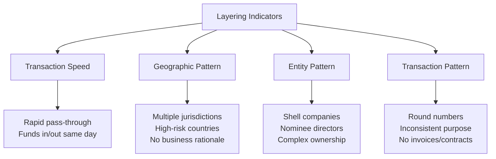

# Layering: The Second Stage of Money Laundering

## What Is Layering?

**Layering** is the second stage of the money laundering process. Once criminal proceeds have been placed into the financial system, the launderer's next objective is to disguise the paper trail and make it as difficult as possible to trace the funds back to their criminal origin.

Layering involves a complex series of financial transactions — wire transfers, currency conversions, corporate structures, asset purchases and sales — designed to create distance between the funds and their source.

:::tip Key Insight
Think of layering as creating a fog. Each transaction is another layer of mist, making it progressively harder for investigators and analysts to see through to the underlying criminal activity.
:::

## Core Objectives of Layering

1. **Obscure the source** — Sever the link between the money and the predicate offense
2. **Complicate investigation** — Create multiple trails, jurisdictions, and entities to exhaust investigative resources
3. **Exploit information asymmetry** — Use offshore jurisdictions, nominee structures, and legal entity types that have limited transparency
4. **Create apparent legitimacy** — Generate transaction records that superficially appear to be legitimate business activity

## Common Layering Techniques

### 1. Wire Transfers Between Jurisdictions

Rapid wire transfers across multiple countries are among the most common and effective layering techniques. Funds are moved through a series of accounts in different jurisdictions — often in countries with strong bank secrecy laws — before eventually being brought back onshore.

**Classic pattern:** Criminal proceeds in Country A → Shell company account in Country B → Investment account in Country C → Personal account in Country D → Real estate purchase in Country A

**Red flags:**
- Rapid "pass-through" activity (funds received and transferred within 24–48 hours)
- Wire transfers to/from high-risk or secrecy jurisdictions
- Multiple jurisdictions with no apparent commercial rationale
- Round-dollar wire transfers with no remittance information

### 2. Shell Companies and Nominee Structures

Shell companies — entities with no genuine business activity — are used to create the appearance of legitimate business transactions. A payment from Shell Co A to Shell Co B "for consulting services" can look like a business expense when it is actually a transfer of criminal funds between accounts controlled by the same criminal.

**Layers of obfuscation:**
- Nominee directors and shareholders (individuals registered as directors/shareholders on behalf of the real owner)
- Offshore jurisdictions with nominee structures (British Virgin Islands, Cayman Islands, Panama, Delaware)
- Trust structures with discretionary beneficiaries
- Multiple layers of holding companies

See: [Shell Companies Typology](/docs/aml/typologies/shell-companies)

### 3. Cryptocurrency Conversion

Virtual assets offer launderers a fast, pseudonymous, borderless layering mechanism. Common crypto-layering techniques:

- **Chain-hopping** — Converting between multiple cryptocurrencies to obscure the trail
- **Mixing / Tumbling** — Using mixing services to pool multiple transactions and return equivalent but different coins
- **DeFi protocols** — Using decentralized finance platforms which may lack AML controls
- **Peer-to-peer (P2P) exchanges** — Converting between crypto and fiat outside regulated exchanges

See: [Cryptocurrency Typologies](/docs/aml/typologies/crypto)

### 4. Purchase and Sale of High-Value Assets

High-value assets — art, jewelry, luxury vehicles, yachts — are purchased with laundered funds, potentially resold, and the proceeds appear as legitimate sales income.

**Why it works:**
- Art market historically lacked AML regulation (changing post-6AMLD in EU)
- Subjective valuation makes over/under-pricing harder to detect
- Can span multiple jurisdictions
- Auction houses and private dealers may have weak AML controls

### 5. Trade-Based Money Laundering (TBML)

International trade transactions are manipulated to transfer value across borders. Over-invoicing, under-invoicing, multiple invoicing, and false description of goods are all TBML techniques that serve layering purposes.

See: [Trade-Based ML Typology](/docs/aml/typologies/trade-based-ml)

### 6. Loan-Back and Back-to-Back Loans

Criminal funds deposited offshore are used as collateral for a "legitimate" bank loan to the same individual or associated company onshore. The loan proceeds appear as legitimate business income.

**Why it's effective:** The bank is lending against real collateral. The loan is legitimate on its face. The criminal has effectively moved the funds onshore with a legitimate paper trail ("I received a loan").

### 7. Round-Tripping

Funds move offshore and return disguised as Foreign Direct Investment (FDI) or legitimate business income.

**Example:** Funds from tax evasion in Country A are deposited in a tax haven, then "invested back" into Country A through a shell company registered in a low-tax jurisdiction. The criminal receives the funds as business investment income, avoiding tax and disguising the source.

## Detection Indicators

### Transaction-Level Red Flags
- Funds received and immediately transferred with no intervening business activity
- Wire transfers using vague or generic descriptions ("consulting fees," "services rendered")
- Transactions between entities with no apparent commercial relationship
- Back-to-back transactions that cancel each other out economically
- Unusually large number of beneficiaries or counterparties

### Entity-Level Red Flags
- Complex multi-layered corporate structures with no apparent commercial purpose
- Nominee directors or shareholders
- Companies registered in secrecy jurisdictions (BVI, Cayman, Delaware, Seychelles)
- No employees, premises, or genuine business activity
- Multiple related companies sharing the same address, phone number, or director

### Behavioral Red Flags
- Customer reluctant to explain the purpose of transactions
- Inability to identify the beneficial owner of counterparty entities
- Use of multiple financial institutions for the same transactions
- Customer uses intermediaries or third parties to conduct transactions

## Investigative Approach

When investigating potential layering, the analyst should:

1. **Map the transaction network** — Visualize all accounts, entities, and transactions involved
2. **Identify the flow of funds** — Trace the path from receipt to disbursement
3. **Challenge every entity** — What is the commercial purpose? Who ultimately controls it?
4. **Look for the source** — Work backwards from the current activity to identify the placement event
5. **Document everything** — Each link in the chain that cannot be explained adds to the suspicion picture

## Case Study: Multi-Jurisdiction Layering

**Background:** A payment gateway identifies an anomalous pattern in a merchant account. The merchant (Company X, registered in the UK) receives funds from various customers, immediately transfers to Company Y (registered in Cyprus), which transfers to Company Z (BVI), which ultimately sends funds to personal accounts in Dubai.

**Analysis conducted:**
- Company X has no website, premises, or verifiable employees
- Company Y's directors are nominees; beneficial owner cannot be determined
- Company Z is registered in BVI with no disclosed UBO
- The entire cycle occurs within 72 hours of each receipt
- Transaction descriptions are generic ("business services")
- The personal accounts in Dubai receive funds inconsistent with any declared income

**Conclusion:** The structure and behavior are consistent with a layering scheme. The beneficial owner of the entire chain appears to be the individual receiving funds in Dubai. SAR filed with UK National Crime Agency (NCA), MOKAS (Cyprus), and UNOCT (UAE).

## Interview Questions

1. **What is the primary objective of layering in money laundering?**
   *The objective is to create distance between criminal proceeds and their source — to obscure the paper trail so thoroughly that linking the funds to the predicate offense becomes difficult or impossible.*

2. **How would you identify a layering transaction in a payment gateway context?**
   *Key indicators include: rapid pass-through transactions (funds received and transferred within 24–48 hours), involvement of shell companies without identifiable beneficial owners, use of high-risk or secrecy jurisdictions, and generic transaction descriptions inconsistent with the stated business purpose.*

3. **Why are shell companies effective layering vehicles?**
   *Shell companies create the appearance of legitimate business transactions. A payment between two companies for "consulting services" looks routine. With nominee directors and offshore jurisdictions, the true beneficial owner may be impossible to identify without advanced investigation.*

## Related Pages

- [Placement Stage](/docs/aml/money-laundering/placement)
- [Integration Stage](/docs/aml/money-laundering/integration)
- [Shell Companies](/docs/aml/typologies/shell-companies)
- [Cryptocurrency AML](/docs/aml/typologies/crypto)
- [Trade-Based ML](/docs/aml/typologies/trade-based-ml)
- [UBO Investigation](/docs/kyb/ubo/overview)
