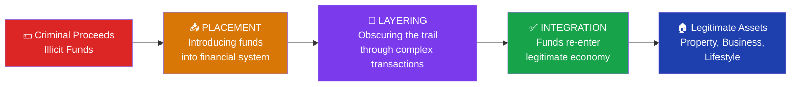
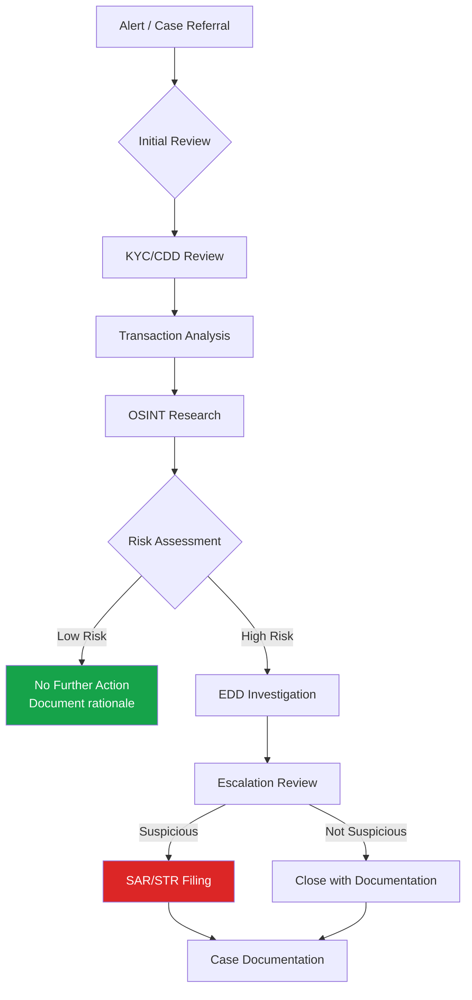

# Money Laundering: Overview

## What Is Money Laundering?

Money laundering is the process of making illegally obtained funds appear legitimate. Criminal proceeds — from drug trafficking, fraud, bribery, human trafficking, tax evasion, or any other predicate offense — are "cleaned" through a series of transactions designed to disguise their origin so they can be used freely without attracting law enforcement attention.

The term originates from the practice of using cash-intensive laundromats to commingle criminal proceeds with legitimate business revenue — a method still used in various forms today.

:::info Definition
**Money laundering** is defined under the Financial Action Task Force (FATF) framework as the processing of criminal proceeds to disguise their illegal origin so that the resulting funds appear to come from a legitimate source.
:::

## Why It Matters

The FATF estimates that between **2%–5% of global GDP** is laundered annually — approximately **$800 billion to $2 trillion USD** every year. This is not merely a financial crime; money laundering:

- **Funds criminal organizations** — Drug cartels, human trafficking networks, and organized crime depend on money laundering to sustain operations
- **Enables corruption** — Proceeds of bribery and embezzlement are laundered to fund further corruption and personal enrichment
- **Distorts economies** — Laundered funds injected into legitimate markets create unfair competition, inflate asset prices, and destort capital allocation
- **Funds terrorism** — Terrorist financing often involves laundering licit or illicit funds to fund attacks and operational costs
- **Destabilizes financial systems** — Banks and financial institutions that process criminal proceeds face regulatory sanctions, reputational damage, and potential collapse

## The Three Stages of Money Laundering

Money laundering typically occurs in three stages. Understanding these stages is foundational to every AML analyst's work.

| Stage | Description | Common Methods |
|-------|-------------|----------------|
| **Placement** | Physical cash enters the financial system | Structuring (smurfing), cash deposits, currency exchange, casino chips |
| **Layering** | Funds are moved to obscure origin | Wire transfers, shell companies, cryptocurrency conversion, trade-based ML |
| **Integration** | Clean money re-enters the legitimate economy | Real estate purchases, business investments, luxury goods, lifestyle spending |

Learn more: [Placement](/docs/aml/money-laundering/placement) | [Layering](/docs/aml/money-laundering/layering) | [Integration](/docs/aml/money-laundering/integration)

## Predicate Offenses

Money laundering does not occur in isolation — it always follows a **predicate offense** (also called a designated category of offense), which is the underlying crime that generates the proceeds to be laundered.

Common predicate offenses include:

- Drug trafficking
- Human trafficking and smuggling
- Fraud (bank fraud, investment fraud, tax fraud)
- Corruption and bribery
- Arms trafficking
- Cybercrime
- Insider trading
- Environmental crimes
- Organized crime and racketeering

See: [Predicate Crimes](/docs/aml/money-laundering/predicate-crimes)

## The AML Regulatory Framework

### FATF — The Global Standard Setter

The **Financial Action Task Force (FATF)** is the intergovernmental body that sets global standards for AML/CFT. Its 40 Recommendations provide the international framework that member countries are expected to implement in national law.

Key FATF frameworks:
- **40 Recommendations** — Core AML/CFT standards
- **Mutual Evaluation Reports** — Country-by-country assessment of compliance
- **High-Risk Jurisdictions** — "Black list" and "Grey list" (also called "Increased Monitoring") countries
- **FATF Guidance** — Sector-specific guidance documents (virtual assets, correspondent banking, etc.)

### Key Regulations by Jurisdiction

| Jurisdiction | Primary AML Legislation |
|---|---|
| **United States** | Bank Secrecy Act (BSA), USA PATRIOT Act, Anti-Money Laundering Act 2020 |
| **United Kingdom** | Proceeds of Crime Act 2002 (POCA), Money Laundering Regulations 2017 (MLR 2017), Terrorism Act 2000 |
| **European Union** | EU AML Directives (1AMLD through 6AMLD), GDPR |
| **India** | Prevention of Money Laundering Act 2002 (PMLA) |
| **Singapore** | Corruption, Drug Trafficking and Other Serious Crimes Act (CDSA) |
| **UAE** | Federal Decree-Law No. 20 of 2018 on AML/CFT |
| **Australia** | Anti-Money Laundering and Counter-Terrorism Financing Act 2006 (AML/CTF Act) |

## Red Flags

:::danger Key Red Flags
Identifying potential money laundering requires pattern recognition. Common indicators include:
:::

import RedFlagList from '../../../src/components/RedFlagList';

- **Structuring / Smurfing** — Transactions deliberately kept below reporting thresholds (e.g., $10,000 CTR threshold in the US)
- **Rapid movement of funds** — Funds received and immediately transferred, especially to high-risk jurisdictions
- **Round dollar amounts** — Unusual frequency of round-number transactions
- **Inconsistency with business/profile** — Transaction volumes inconsistent with the customer's stated business or income
- **Complex corporate structures** — Multiple layers of shell companies, nominees, or trusts with no apparent commercial purpose
- **Reluctance to provide documentation** — Customer is evasive or uncooperative with CDD/EDD requests
- **Unexplained source of funds** — Large cash deposits or fund transfers with no plausible legitimate explanation
- **High-risk jurisdictions** — Transactions involving countries on FATF High-Risk or Increased Monitoring lists
- **Unusual transaction patterns** — Activity inconsistent with customer history or peer group
- **Third-party payments** — Payments made to or from unrelated third parties

## The AML Investigation Process

## Key Interview Questions

1. **What are the three stages of money laundering? Give an example of each.**
2. **What is the difference between a predicate offense and money laundering?**
3. **How does FATF influence domestic AML regulations?**
4. **What is structuring/smurfing, and how do you identify it?**
5. **Why is money laundering harmful beyond the financial crime itself?**

## Checklist: Money Laundering Indicators Review

- [ ] Transaction volume consistent with customer profile?
- [ ] Source of funds adequately explained?
- [ ] Any structuring patterns detected?
- [ ] Involvement of high-risk jurisdictions?
- [ ] Beneficial ownership clearly established?
- [ ] Transaction counterparties verified?
- [ ] Any adverse media or sanctions hits?
- [ ] Pattern consistent with known typologies?

## Related Topics

- [Placement Stage](/docs/aml/money-laundering/placement)
- [Layering Stage](/docs/aml/money-laundering/layering)
- [Integration Stage](/docs/aml/money-laundering/integration)
- [Predicate Crimes](/docs/aml/money-laundering/predicate-crimes)
- [Terrorist Financing](/docs/aml/terrorist-financing/overview)
- [AML Typologies](/docs/aml/typologies/shell-companies)
- [KYC/CDD](/docs/kyc/overview)

## Further Reading

- [FATF 40 Recommendations](https://www.fatf-gafi.org/en/topics/fatf-recommendations.html)
- [FATF Guidance on Money Laundering](https://www.fatf-gafi.org)
- [FinCEN Advisories & Guidance](https://www.fincen.gov/resources/advisories)
- [ACAMS Learning Resources](https://www.acams.org)
