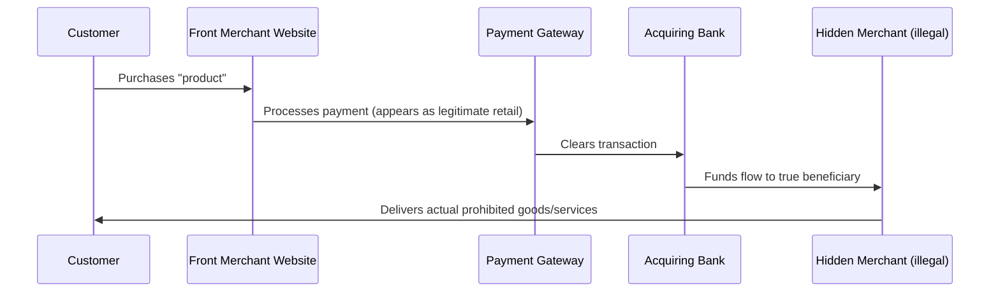

# Transaction Laundering

## What Is Transaction Laundering?

**Transaction laundering** (also called **payment laundering**) is the online equivalent of money laundering through commerce. An undisclosed merchant processes payments for prohibited goods or services through another merchant's legitimate payment account.

It is essentially a three-party scheme:
1. A **prohibited merchant** (selling drugs, counterfeit goods, illegal gambling, etc.) cannot directly obtain merchant processing
2. A **front merchant** obtains a legitimate merchant account (often unknowingly or knowingly)
3. The prohibited merchant routes its customers through the front merchant's payment infrastructure

## How It Works

## Common Prohibited Activities Using Transaction Laundering

- Online pharmacies (prescription drugs without prescription)
- Illegal gambling and sports betting
- Counterfeit goods
- Unlicensed financial services
- CSAM-adjacent sites
- Weapons and firearms accessories
- Fraudulent investment schemes

## Detection Red Flags (Payment Gateway Context)

This is directly relevant to payment gateway AML/fraud operations:

- **Descriptor mismatch** — The merchant descriptor on cardholder statements doesn't match the actual merchant website or product
- **High chargeback rate** — Customers dispute transactions they don't recognize
- **Refund abuse** — Unusual refund patterns
- **URL mismatch** — The website URL submitted doesn't match transaction URLs
- **MCC mismatch** — The Merchant Category Code doesn't match actual goods/services
- **No verifiable product or service** — Website is vague, non-functional, or inconsistent with stated business
- **Multiple merchants, same bank account** — Different merchant entities funneling to one account
- **Rapid volume spike** — Volume grows unnaturally fast for a new merchant

## Investigative Approach

1. **Website verification** — Is the website real? What does it sell? Is it consistent with the MCC?
2. **Descriptor review** — Match the statement descriptor to the actual product
3. **Chargeback analysis** — What are customers disputing? What reasons are they giving?
4. **OSINT** — Is the domain associated with prohibited activity? App stores? Forums?
5. **Corporate verification** — Does the registrant of the website match the merchant account holder?

## Interview Questions

1. **What is transaction laundering in a payment gateway context?**
2. **How is transaction laundering different from traditional money laundering?**
3. **What indicators would you look for in a payment gateway to identify transaction laundering?**
4. **How do chargebacks help detect transaction laundering?**

## Related Pages

- [Merchant Due Diligence](/docs/kyb/merchant-due-diligence/overview)
- [Merchant Investigation Lab](/docs/labs/merchant-investigation)
- [Transaction Monitoring](/docs/transaction-monitoring/overview)
- [Layering Stage](/docs/aml/money-laundering/layering)
