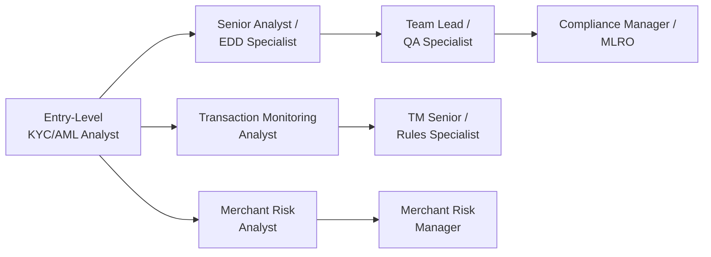

# Career & Interview Preparation

## Navigating an AML/KYC Career

The financial crime compliance field offers diverse career paths — from entry-level analyst roles through specialized investigation tracks to senior leadership, QA, and consulting positions.

## Common Career Tracks

## Role Types Covered

→ [AML Analyst Interview Prep](/docs/career/interview/aml-analyst)
→ [KYC Analyst Interview Prep](/docs/career/interview/kyc-analyst)
→ [EDD Analyst Interview Prep](/docs/career/interview/edd-analyst)
→ [Compliance QA Interview Prep](/docs/career/interview/compliance-qa)

## Certifications

Professional certifications can significantly accelerate career progression and improve compensation potential:

→ [CAMS](/docs/career/certifications/cams) — ACAMS' globally recognized certification
→ [CFCS](/docs/career/certifications/cfcs) — ACFCS Certified Financial Crime Specialist
→ [CGSS](/docs/career/certifications/cgss) — ACAMS Certified Global Sanctions Specialist

## General Interview Preparation Tips

### Use the STAR Format
Structure behavioral answers using **Situation, Task, Action, Result**:
- **Situation** — Context of the scenario
- **Task** — What was required of you
- **Action** — Specific steps you took
- **Result** — Outcome, ideally quantified

### Know Your Own Cases
Be ready to discuss specific (anonymized) cases from your own experience — generic answers are far less compelling than concrete examples with real numbers, timelines, and outcomes.

### Understand the Specific Role's Focus
- AML Analyst roles often focus on transaction monitoring and investigation
- KYC Analyst roles focus on onboarding and CDD
- EDD Analyst roles focus on deep investigation methodology
- Compliance QA roles focus on review methodology and feedback delivery

### Prepare Questions to Ask
Interviewers consistently value candidates who ask thoughtful questions about the team's caseload, tools used, escalation processes, and growth opportunities.

## Salary Negotiation Considerations

When negotiating compensation, consider:
- Total compensation (base + bonus + benefits), not just base salary
- Market rate for the specific role/location/seniority combination
- The value of certifications (CAMS often correlates with measurable salary premiums)
- Growth trajectory and promotion timeline at the specific institution

## Interview Questions

(See role-specific pages for detailed question banks)

## Related Pages

- [Interview Prep: AML Analyst](/docs/career/interview/aml-analyst)
- [Interview Prep: KYC Analyst](/docs/career/interview/kyc-analyst)
- [Interview Prep: EDD Analyst](/docs/career/interview/edd-analyst)
- [Interview Prep: Compliance QA](/docs/career/interview/compliance-qa)
- [CAMS Certification](/docs/career/certifications/cams)
