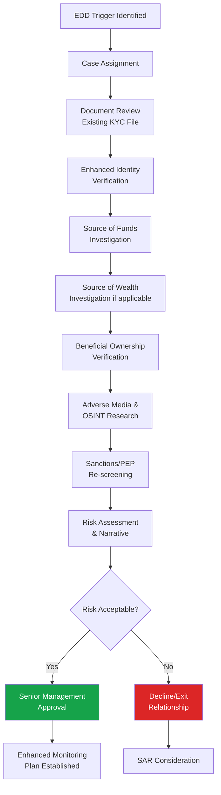

# Enhanced Due Diligence (EDD)

## What Is EDD?

**Enhanced Due Diligence (EDD)** is a deeper level of customer due diligence applied to customers, relationships, or transactions assessed as higher risk for money laundering, terrorist financing, or other financial crime. EDD goes significantly beyond standard CDD in depth, scrutiny, and approval requirements.

EDD is mandated under FATF Recommendation 10, and codified in domestic regulation (e.g., MLR 2017 Regulation 33 in the UK, FinCEN CDD Rule enhancements in the US).

## EDD vs. Standard CDD

| Aspect | Standard CDD | EDD |
|---|---|---|
| **Identity verification** | Standard documents | Standard + additional verification |
| **Source of funds** | General confirmation | Documented evidence required |
| **Source of wealth** | Not typically required | Required for PEPs/high net worth |
| **Approval** | Front-line staff | Senior management approval required |
| **Monitoring frequency** | Standard | Enhanced/more frequent |
| **Adverse media** | Basic check | Comprehensive ongoing monitoring |
| **Documentation depth** | Moderate | Extensive, detailed rationale required |

## When Is EDD Required?

→ See full list: [EDD Triggers](/docs/edd/triggers)

Common EDD triggers include:
- Customer is a **Politically Exposed Person (PEP)** or RCA
- Customer/transaction involves a **high-risk jurisdiction**
- **Complex ownership structures** with unclear beneficial ownership
- **Adverse media** findings about the customer
- **Correspondent banking** relationships
- **Private banking** relationships above certain thresholds
- **Unusual transaction patterns** identified through monitoring
- Customer operates in a **high-risk industry** (MSBs, crypto, arms, gambling, precious metals)
- **Non-face-to-face** relationships without additional verification

## The EDD Investigation Process

→ [Investigation Process Detail](/docs/edd/investigation-process)

## Core EDD Components

### 1. Enhanced Identity & Ownership Verification
Beyond standard ID checks — verifying beneficial ownership through layered corporate structures, trust documentation, and independent source confirmation.

### 2. Source of Funds (SoF)
Establishing the origin of the specific funds used in a transaction or to open an account.

→ [Source of Funds](/docs/edd/source-of-funds)

### 3. Source of Wealth (SoW)
Establishing how the customer accumulated their overall net worth (broader than SoF, applies primarily to PEPs and HNW individuals).

→ [Source of Wealth](/docs/edd/source-of-wealth)

### 4. Adverse Media & OSINT Research
Comprehensive research using public records, news archives, court records, and corporate registries.

→ [OSINT Overview](/docs/screening/osint/overview)

### 5. Purpose and Nature of Relationship
Detailed understanding of why the customer wants this specific relationship/product and how they intend to use it.

### 6. Senior Management Approval
EDD cases require sign-off from senior management or a dedicated EDD/Compliance committee before the relationship is established or continued.

## EDD Documentation Requirements

| Document Type | Examples |
|---|---|
| Identity | Enhanced ID verification, independent confirmation |
| Source of Funds | Bank statements, salary slips, sale agreements, gift deeds |
| Source of Wealth | Tax returns, business valuations, inheritance documents, investment statements |
| Beneficial Ownership | Trust deeds, shareholder registers, UBO declarations with supporting evidence |
| Business Rationale | Business plans, contracts, invoices supporting expected activity |
| Adverse Media | Research summary documenting findings and risk assessment |

## EDD Narrative Writing

A strong EDD narrative should:
1. **State the trigger** — Why was EDD required?
2. **Summarize findings** — What was found in each area of investigation?
3. **Assess risk** — What is the overall risk level and why?
4. **Provide recommendation** — Approve, decline, exit, or escalate?
5. **Document mitigants** — What controls reduce the identified risk?

→ [EDD Narrative Writing Guide](/docs/edd/narrative-writing)

## Common EDD Investigation Mistakes

- Treating EDD as a checklist rather than a genuine risk assessment
- Insufficient documentation of rationale for approval decisions
- Failing to verify source of funds with independent evidence (relying solely on customer statements)
- Not escalating when red flags emerge mid-investigation
- Inconsistent application across similar risk profiles

## Interview Questions

1. **What is EDD and how does it differ from standard CDD?**
2. **What are common triggers for EDD?**
3. **What is the difference between Source of Funds and Source of Wealth?**
4. **Walk me through your EDD investigation process for a new PEP customer.**
5. **What documentation would you require to verify source of wealth for a high-net-worth individual?**
6. **How do you handle a situation where the customer cannot adequately explain their source of funds?**

## EDD Checklist

- [ ] EDD trigger clearly identified and documented
- [ ] Enhanced identity verification completed
- [ ] Beneficial ownership fully mapped and verified
- [ ] Source of funds documented with independent evidence
- [ ] Source of wealth assessed (if applicable)
- [ ] Adverse media and OSINT research conducted
- [ ] Sanctions/PEP screening re-confirmed
- [ ] Risk assessment narrative completed
- [ ] Senior management approval obtained
- [ ] Enhanced monitoring plan established
- [ ] SAR filing considered if suspicious activity identified

## Related Pages

- [EDD Triggers](/docs/edd/triggers)
- [Investigation Process](/docs/edd/investigation-process)
- [Source of Funds](/docs/edd/source-of-funds)
- [Source of Wealth](/docs/edd/source-of-wealth)
- [EDD Narrative Writing](/docs/edd/narrative-writing)
- [PEP Screening](/docs/screening/pep/overview)
- [EDD Investigation Lab](/docs/labs/edd-investigation)
