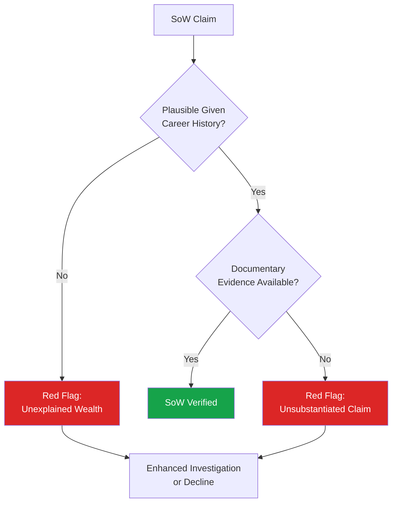

# Source of Wealth (SoW)

## What Is Source of Wealth?

**Source of Wealth (SoW)** refers to the origin of a customer's overall net worth — how they accumulated their wealth over their lifetime, not just the specific funds in a single transaction. SoW assessment is primarily required for Politically Exposed Persons (PEPs) and high-net-worth individuals.

:::info Key Distinction
SoW answers: **"How did this person become wealthy overall?"**
SoF answers: **"Where did this specific transaction's funds come from?"**
A complete EDD file typically requires both.
:::

## When Is SoW Required?

- All PEP relationships (mandatory under most regulatory frameworks)
- High-net-worth/private banking relationships above defined thresholds
- Customers whose declared wealth significantly exceeds what their occupation/history would typically generate
- Complex trust or corporate structures holding significant assets

## SoW Investigation Components

### 1. Career and Professional History
- Employment history, business ownership, executive positions
- Equity compensation, stock options, business sale proceeds
- Professional fees (legal, consulting, etc.)

### 2. Business Ownership and Investments
- Ownership stakes in businesses, valuation history
- Dividend income, capital gains
- Investment portfolio composition and growth

### 3. Inheritance and Gifts
- Family wealth transfers, estate distributions
- Documentation: wills, probate records, gift deeds

### 4. Real Estate Holdings
- Property portfolio, rental income, appreciation
- Verification through land registries where accessible

### 5. For PEPs Specifically
- Government salary history (typically modest relative to claimed wealth)
- Business interests held before/during/after public office
- Family business interests that may benefit from political position

## SoW Plausibility Assessment

A core skill in SoW investigation is assessing **plausibility** — does the claimed wealth accumulation story make sense given the verifiable facts?

## Documentation Standards

| Wealth Source | Required Documentation |
|---|---|
| Business ownership | Company financials, shareholding records, business valuation |
| Salary/bonuses | Multi-year tax returns, employment verification |
| Investment gains | Brokerage statements, historical portfolio records |
| Inheritance | Probate documents, estate tax filings |
| Real estate | Title deeds, valuation reports, rental agreements |
| Sale of business | Sale and purchase agreement, tax clearance certificates |

## Red Flags in SoW Assessment

- Wealth significantly disproportionate to known career/public salary (especially for PEPs)
- Inability to provide documentary evidence for claimed wealth sources
- Wealth concentrated in opaque jurisdictions with limited transparency
- Family members of PEPs holding disproportionate business interests
- Rapid wealth accumulation coinciding with periods of public office
- Wealth derived from industries known for corruption risk in the relevant jurisdiction (extractive industries, government contracting)

## Case Study: PEP Source of Wealth

**Scenario:** A former government minister (now a private citizen) seeks to open a private banking relationship, declaring net worth of approximately $15 million.

**Investigation findings:**
- Government salary history shows maximum annual compensation of approximately $45,000
- Customer claims wealth derived from "family business" in agricultural exports
- Investigation reveals the "family business" was incorporated only 2 years before the individual entered public office
- Business shows minimal trading activity inconsistent with claimed revenue
- Adverse media search reveals prior allegations (unproven) of contract irregularities during the individual's tenure as minister

**Conclusion:** SoW claim is not adequately substantiated. The timeline and business activity are inconsistent with claimed wealth accumulation. High corruption risk given PEP status and unverifiable wealth source. Relationship declined.

## Interview Questions

1. **What is the difference between Source of Wealth and Source of Funds?**
2. **Why is SoW particularly important for PEP relationships?**
3. **How would you assess the plausibility of a SoW claim?**
4. **What documentation would you require to verify wealth derived from business ownership?**
5. **What are red flags specific to PEP source of wealth assessments?**

## Related Pages

- [Source of Funds](/docs/edd/source-of-funds)
- [EDD Overview](/docs/edd/overview)
- [PEP Screening](/docs/screening/pep/overview)
- [PEP Investigation](/docs/screening/pep/investigation)
- [Real Estate Typology](/docs/aml/typologies/real-estate)
