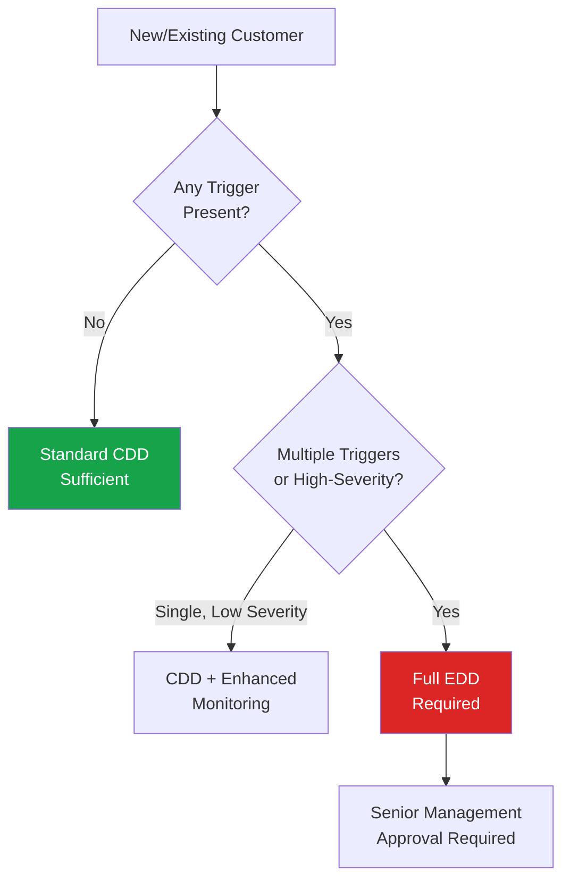

# EDD Triggers

## Overview

Identifying when EDD is required is a critical skill for analysts. This page provides a comprehensive checklist of triggers used across most institutional risk frameworks.

## Customer-Based Triggers

| Trigger | Rationale |
|---|---|
| **PEP status** | Higher corruption/bribery risk due to public office |
| **RCA (Relative/Close Associate of PEP)** | PEP risk extends to those who could be used to layer transactions |
| **Adverse media** | Negative news suggests potential criminal involvement |
| **Complex ownership structure** | Difficulty identifying true beneficial owner |
| **Trust or nominee arrangements** | Obscured ultimate beneficiary |
| **Previous SAR filings (internal or known externally)** | Historical suspicion of financial crime |
| **Customer refuses to provide information** | Non-cooperation is itself a red flag |

## Geographic Triggers

| Trigger | Rationale |
|---|---|
| **FATF High-Risk Jurisdictions ("Black List")** | Identified strategic AML/CFT deficiencies |
| **FATF Increased Monitoring ("Grey List")** | Jurisdictions actively addressing deficiencies but not yet compliant |
| **OFSI/OFAC/UN sanctioned countries** | Direct sanctions exposure |
| **Tax havens / secrecy jurisdictions** | Limited transparency, often used for layering |
| **Conflict zones** | Terrorist financing and corruption risk |

## Product/Service Triggers

| Trigger | Rationale |
|---|---|
| **Correspondent banking** | Indirect exposure to underlying customers of respondent bank |
| **Private banking (above threshold)** | High-value, often complex relationships |
| **Trade finance** | High exposure to TBML |
| **Cash-intensive products** | Higher placement risk |
| **Virtual asset products** | Pseudonymity and cross-border speed risk |

## Industry/Business Triggers

| Trigger | Rationale |
|---|---|
| **Money Service Businesses (MSBs)** | High-risk, cash-intensive, often unregulated sub-agents |
| **Casinos and gaming** | Cash-intensive, layering vehicle |
| **Precious metals/stones dealers** | High value, portable, layering/integration vehicle |
| **Arms dealers** | Direct link to predicate crimes |
| **Cryptocurrency businesses** | Pseudonymity, cross-border speed |
| **Real estate agents/developers** | Common integration vehicle |
| **Charities/NPOs (especially in conflict-adjacent regions)** | TF misuse risk |
| **Import/export businesses** | TBML exposure |

## Transaction-Based Triggers

| Trigger | Rationale |
|---|---|
| **Transactions inconsistent with customer profile** | Behavior anomaly |
| **Rapid movement of large funds** | Potential layering |
| **Transactions with no clear economic purpose** | Lack of legitimate rationale |
| **Use of multiple related accounts** | Potential structuring or layering |
| **Round-dollar or threshold-adjacent transactions** | Potential structuring |

## Relationship-Based Triggers

| Trigger | Rationale |
|---|---|
| **Non-face-to-face onboarding without additional verification** | Higher impersonation risk |
| **Third-party introduced business** | Reduced direct verification |
| **Long periods of dormancy followed by activity** | Potential account takeover or misuse |
| **Multiple accounts opened in short succession** | Potential structuring/mule activity |

## Decision Framework

## Interview Questions

1. **List five common EDD triggers across different categories.**
2. **Why do RCAs require EDD, not just the PEP themselves?**
3. **How would you handle a scenario with multiple low-severity triggers vs. one high-severity trigger?**

## Related Pages

- [EDD Overview](/docs/edd/overview)
- [Investigation Process](/docs/edd/investigation-process)
- [PEP Categories](/docs/screening/pep/categories)
- [Country Risk](/docs/risk-assessment/country-risk)
