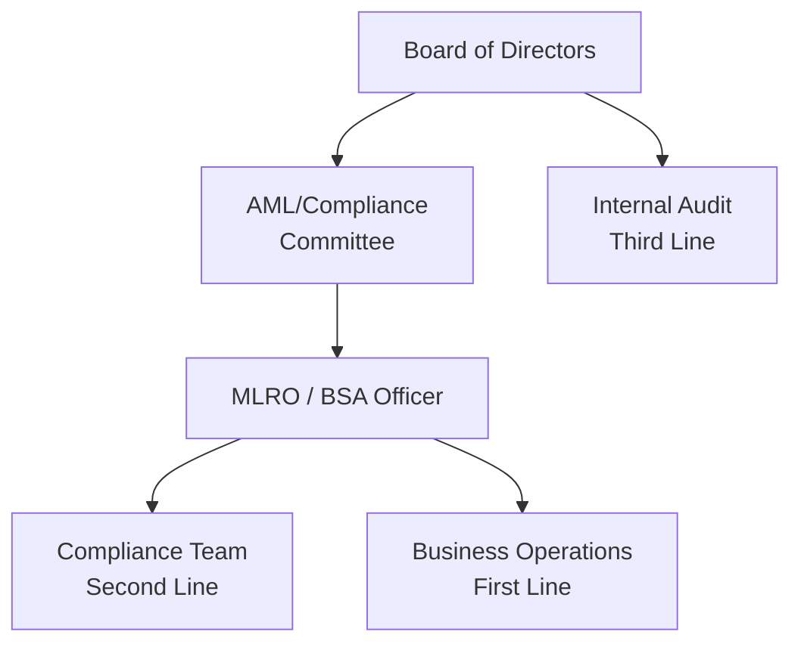

# AML Program Components

## The Four (or Five) Pillars of an AML Program

Most regulatory frameworks (notably the US BSA framework, widely referenced globally) require an AML program to include:

### 1. Designated AML/BSA Officer
A senior individual with appropriate authority and resources, responsible for day-to-day AML program management (often called the MLRO — Money Laundering Reporting Officer — in UK/Commonwealth frameworks).

### 2. Written Policies, Procedures, and Internal Controls
Comprehensive documentation covering CDD/EDD, transaction monitoring, sanctions screening, SAR filing, and recordkeeping.

### 3. Training Program
Regular, role-appropriate AML training for all relevant staff, with completion tracking.

### 4. Independent Testing (Audit)
Periodic independent review (internal or external audit) of the AML program's effectiveness.

### 5. (Added under the 2018 CDD Rule, US) Customer Due Diligence
Ongoing CDD requirements, including beneficial ownership identification, as a formal fifth pillar in the US framework.

## Risk Assessment as the Foundation

The Enterprise-Wide Risk Assessment (EWRA) should inform all program components — policy design, resource allocation, training focus, and audit scope should all be calibrated to the institution's actual risk profile.

→ [Risk Assessment Overview](/docs/risk-assessment/overview)

## Governance Structure

## Interview Questions

1. **What are the core pillars of an AML program?**
2. **What is the role of the MLRO/BSA Officer?**
3. **How does the Enterprise-Wide Risk Assessment inform program design?**

## Related Pages

- [Three Lines of Defence](/docs/governance/three-lines-of-defence)
- [Risk Assessment Overview](/docs/risk-assessment/overview)
- [QA Overview](/docs/qa/overview)
