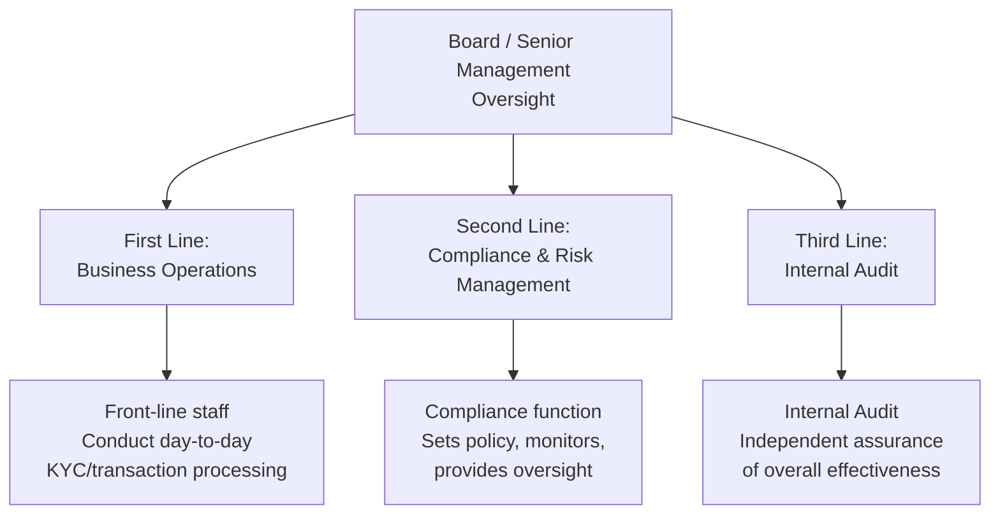

# Three Lines of Defence

## The Model

The **Three Lines of Defence** model is the standard governance framework used by financial institutions to organize risk management and compliance responsibilities across the organization.

## First Line of Defence: Business Operations

The first line consists of front-line staff and business units who directly interact with customers and conduct day-to-day operations:
- Relationship managers, onboarding teams
- AML analysts conducting CDD/EDD/transaction monitoring
- Operational teams processing transactions

**Responsibility:** Own and manage risk in their day-to-day activities; apply policies and procedures correctly; escalate issues appropriately.

## Second Line of Defence: Compliance and Risk Management

The second line provides oversight, sets policy, and monitors first-line effectiveness:
- Compliance function (AML/BSA Officer, MLRO)
- Risk management function
- QA/QC teams (in many organizational structures)

**Responsibility:** Design AML policies and procedures; provide guidance and training; monitor first-line compliance; escalate significant issues to senior management/Board.

## Third Line of Defence: Internal Audit

The third line provides independent, objective assurance on the overall effectiveness of both the first and second lines:
- Internal Audit function
- Sometimes supplemented by external audit/regulatory examination

**Responsibility:** Independently test and evaluate the adequacy and effectiveness of risk management and compliance frameworks; report findings directly to the Board/Audit Committee.

## Why Independence Matters

Each line must maintain appropriate independence from the ones below it:
- Second line (Compliance) should not be managed by or subordinate to first-line business heads in a way that compromises objectivity
- Third line (Internal Audit) must be independent of both first and second lines, typically reporting directly to the Board/Audit Committee

## Common Governance Failures

- **Line blurring** — Compliance function effectively controlled by business line management, compromising independence
- **Resource starvation** — Second/third line functions inadequately resourced relative to first-line risk volume
- **Tone from the top failures** — Senior management not genuinely supporting compliance culture despite formal policy statements

## Interview Questions

1. **Explain the Three Lines of Defence model and the role each line plays.**
2. **Why is independence between the lines important?**
3. **Where would a QA/QC function typically sit within this model?**
4. **What governance failures commonly undermine this model in practice?**

## Related Pages

- [QA Overview](/docs/qa/overview)
- [AML Program](/docs/governance/aml-program)
