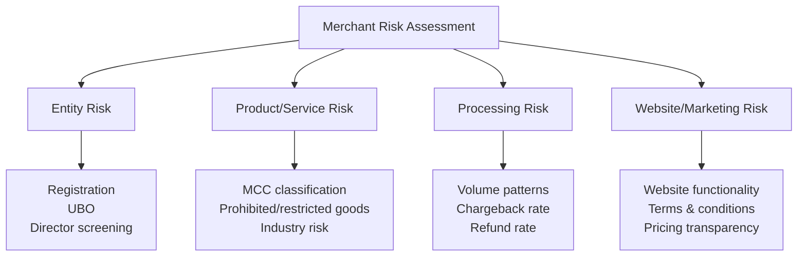

# Merchant Due Diligence (MDD)

## What Is Merchant Due Diligence?

**Merchant Due Diligence (MDD)** is the specialized form of KYB conducted by payment gateways, acquiring banks, and Payment Service Providers (PSPs) before onboarding a merchant to process card or alternative payments. MDD focuses heavily on the **nature of the products/services sold**, the **risk of the business model**, and **transaction processing patterns** — areas that go beyond standard KYB.

This is the core compliance discipline for analysts working at payment gateways, card schemes, and acquiring banks.

## Why MDD Differs from Standard KYB

| Standard KYB | Merchant Due Diligence |
|---|---|
| Focuses on entity legitimacy | Focuses on entity legitimacy **AND** product/service risk |
| Static at onboarding | Continuous monitoring of transaction behavior |
| General AML risk assessment | Card scheme-specific risk categories (MCC-based) |
| Looks at ownership | Also examines website, product delivery, refund/chargeback patterns |

## MDD Risk Assessment Framework

## Key MDD Components

### 1. Business Model Assessment
- What does the merchant actually sell?
- Is the business model consistent with the application/website?
- Is the product/service legal in the merchant's and customers' jurisdictions?

### 2. Merchant Category Code (MCC) Verification
Each merchant is classified with an MCC reflecting their business type, which determines applicable card scheme rules and risk category.

| MCC Category | Risk Level |
|---|---|
| Grocery, utilities | Low |
| General retail, professional services | Low-Medium |
| Travel, subscription services | Medium |
| Adult content, gambling, nutraceuticals | High |
| Cryptocurrency, forex trading, unlicensed pharma | Very High |

### 3. Prohibited and Restricted Business Lists
Card schemes (Visa, Mastercard) and acquiring banks maintain lists of prohibited business types:

**Commonly Prohibited:**
- Illegal drugs and drug paraphernalia
- Unlicensed gambling
- Child exploitation material
- Counterfeit goods
- Pyramid schemes / Ponzi schemes
- Unregistered securities offerings

**Commonly Restricted (require enhanced approval):**
- Adult content
- Nutraceuticals/supplements
- Travel services (due to high chargeback/refund risk)
- Cryptocurrency exchanges
- Tobacco/vaping products
- Firearms accessories

### 4. Website and Marketing Review
- Verify the website is functional and matches the stated business
- Check pricing is clearly displayed
- Review terms & conditions, refund policy, privacy policy presence
- Verify contact information and customer support availability
- Check for misleading claims (especially in health/financial products)

### 5. Transaction Processing Risk
- Expected transaction volume and average ticket size
- Chargeback rate thresholds (card schemes set maximum acceptable rates)
- Refund rate patterns
- Cross-border vs. domestic transaction mix

## MDD Investigation Process

→ [Investigation Process Detail](/docs/kyb/merchant-due-diligence/investigation-process)

## Red Flags

→ [Merchant Red Flags](/docs/kyb/merchant-due-diligence/red-flags)

## Interview Questions

1. **What is Merchant Due Diligence and how does it differ from standard KYB?**
2. **What is an MCC and why does it matter for risk classification?**
3. **What are commonly prohibited vs. restricted business categories?**
4. **How would you verify a merchant's website matches their stated business?**
5. **What chargeback rate would you consider a red flag, and why?**

## Related Pages

- [Investigation Process](/docs/kyb/merchant-due-diligence/investigation-process)
- [Red Flags](/docs/kyb/merchant-due-diligence/red-flags)
- [Payment Processors](/docs/kyb/merchant-due-diligence/payment-processors)
- [Transaction Laundering](/docs/aml/typologies/transaction-laundering)
- [Merchant Investigation Lab](/docs/labs/merchant-investigation)
