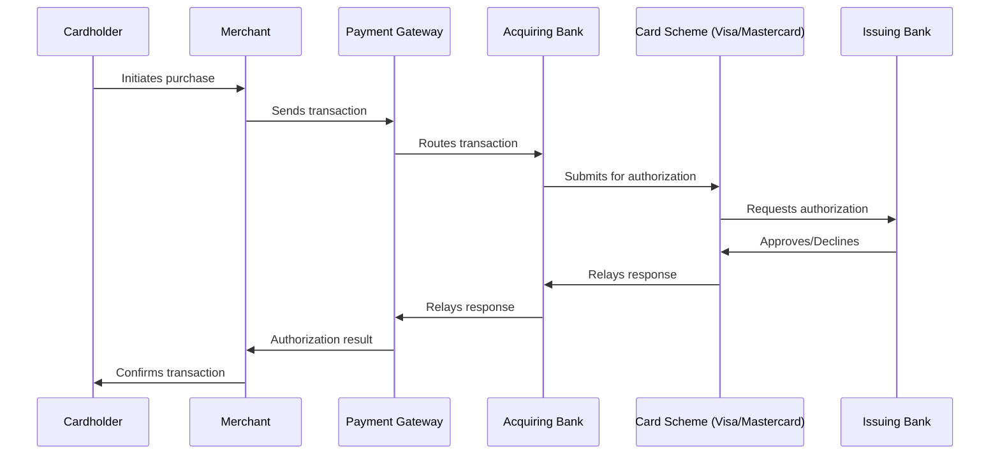

# Payment Processors, PSPs & Card Schemes

## The Payment Ecosystem

Understanding the payment ecosystem is essential context for merchant risk analysts.

## Key Players and Their Roles

| Entity | Role | AML Responsibility |
|---|---|---|
| **Merchant** | Sells goods/services | Subject of KYB/MDD |
| **Payment Gateway** | Technical processing layer connecting merchant to acquirer | Merchant onboarding, transaction monitoring |
| **Payment Service Provider (PSP)** | May combine gateway + acquiring functions, often serves multiple sub-merchants | Aggregated merchant risk management |
| **Acquiring Bank** | Holds the merchant relationship with the card scheme; settles funds to merchant | Underwriting, ultimate AML responsibility for merchant portfolio |
| **Card Scheme** (Visa, Mastercard, etc.) | Sets rules, operates network, maintains prohibited business lists | Rule enforcement, MATCH list maintenance |
| **Issuing Bank** | Issues cards to consumers, approves/declines transactions | Cardholder-side fraud/AML controls |

## PSP / Payment Facilitator (PayFac) Models

A **Payment Facilitator (PayFac)** model allows a PSP to onboard "sub-merchants" under its own master merchant account with the acquiring bank, rather than each sub-merchant having a direct relationship. This creates additional AML considerations:

- The PayFac is responsible for KYB/MDD on all sub-merchants
- The acquiring bank retains ultimate responsibility and oversight over the PayFac's portfolio
- Card schemes impose specific registration and risk management requirements on PayFacs

## Why This Matters for AML Analysts

For analysts working at payment gateways (like Vikas's context), understanding this chain clarifies:
- **Who is responsible for what** — the gateway, the acquirer, and the scheme each have overlapping but distinct AML obligations
- **Where escalations need to go** — a confirmed prohibited merchant may need reporting to the card scheme (MATCH list) in addition to internal SAR filing
- **Multi-jurisdiction complexity** — gateways processing globally must apply AML standards across the jurisdictions of merchant, acquirer, and cardholder

## Settlement and Reserve Accounts

High-risk merchants are often subject to:
- **Rolling reserves** — A percentage of each transaction held back to cover potential future chargebacks
- **Delayed settlement** — Funds held longer before disbursement to the merchant
- **Reduced processing limits** — Caps on daily/monthly transaction volume

These are risk mitigation tools used alongside (not instead of) proper MDD.

## Interview Questions

1. **Walk through the full lifecycle of a card transaction from cardholder to issuing bank.**
2. **What is a Payment Facilitator (PayFac) model and what additional AML risk does it introduce?**
3. **What are rolling reserves and why are they used for high-risk merchants?**
4. **What is the MATCH list?**

## Related Pages

- [MDD Overview](/docs/kyb/merchant-due-diligence/overview)
- [Merchant Red Flags](/docs/kyb/merchant-due-diligence/red-flags)
- [Transaction Laundering](/docs/aml/typologies/transaction-laundering)
