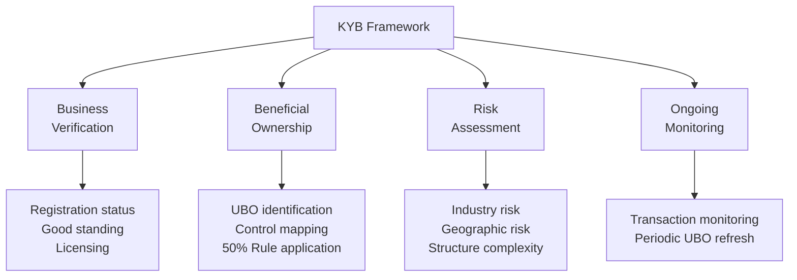
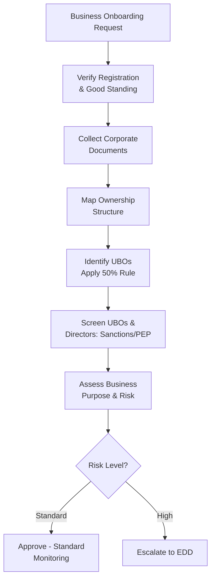

# Know Your Business (KYB)

## What Is KYB?

**Know Your Business (KYB)** is the process of verifying the legitimacy of a business entity, understanding its ownership and control structure, and assessing the AML/financial crime risk it presents. KYB is the entity-level counterpart to KYC, but is significantly more complex due to layered ownership structures, multiple jurisdictions, and the need to "look through" the entity to identify the natural persons who ultimately own or control it.

:::info Why KYB Is Harder Than KYC
A human being has one identity. A business can have multiple layers of ownership, nominee directors, trust structures, and cross-border registrations — each adding complexity to the verification process.
:::

## Core Components of KYB

### 1. Business Verification
Confirming the entity exists, is properly registered, and is in good standing.

→ [Business Verification](/docs/kyb/business-verification)

### 2. Beneficial Ownership (UBO)
Identifying the natural persons who ultimately own or control the entity.

→ [UBO Overview](/docs/kyb/ubo/overview)

### 3. Merchant Due Diligence (Payments-Specific)
For payment gateways and acquirers, a specialized form of KYB focused on assessing the risk of the products/services the merchant sells and how transactions are processed.

→ [Merchant Due Diligence](/docs/kyb/merchant-due-diligence/overview)

## Required KYB Documentation

| Document | Purpose |
|---|---|
| Certificate of Incorporation | Confirms legal existence |
| Memorandum & Articles of Association | Defines corporate powers and structure |
| Register of Directors | Identifies who controls day-to-day operations |
| Register of Shareholders/Members | Identifies ownership |
| Certificate of Good Standing | Confirms entity is active and compliant |
| UBO Declaration | Self-declared beneficial ownership |
| Business License (where applicable) | Confirms regulatory authorization for the activity |
| Proof of business address | Confirms operational presence |
| Financial statements | Supports source of funds/business plausibility |

## Entity Types and Their KYB Complexity

| Entity Type | Complexity | Key Challenge |
|---|---|---|
| Sole Proprietorship | Low | Often identical to individual KYC |
| Partnership | Low-Medium | Identify all partners |
| Private Limited Company | Medium | Layered shareholders possible |
| Public Listed Company | Medium | Often simplified due to disclosure requirements |
| Trust | High | Settlor, trustee, beneficiaries, protector all relevant |
| Foundation | High | Civil law concept, varies by jurisdiction |
| Multi-layered Holding Structure | Very High | Requires tracing through each layer to natural persons |

## KYB Investigation Workflow

## Interview Questions

1. **What is KYB and how does it differ from KYC?**
2. **What documents are required to verify a corporate customer?**
3. **What makes trust structures particularly complex in KYB?**
4. **How do you approach a multi-layered ownership structure?**

## Related Pages

- [Business Verification](/docs/kyb/business-verification)
- [UBO Overview](/docs/kyb/ubo/overview)
- [Ownership Structures](/docs/kyb/ubo/ownership-structures)
- [Merchant Due Diligence](/docs/kyb/merchant-due-diligence/overview)
