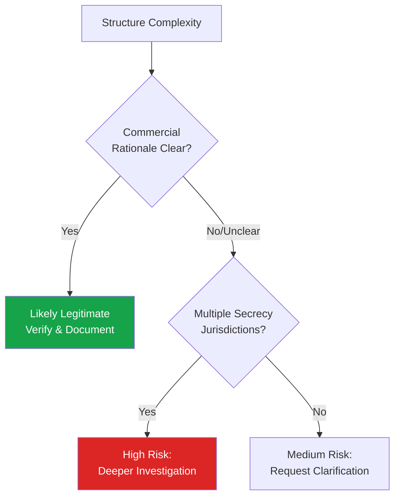

# Complex Ownership Structures

## Overview

Understanding common ownership structure patterns helps analysts efficiently identify where genuine UBO complexity exists versus where complexity may be deliberately constructed to obscure ownership.

## Common Legitimate Structures

### Holding Company Structures
Large multinational groups commonly use holding company structures for tax efficiency, liability separation, and operational organization. These are generally legitimate when:
- Structure mirrors genuine multi-country operations
- Each entity has identifiable business purpose
- Group structure is publicly disclosed (especially for listed groups)

### Private Equity / Investment Fund Structures
Fund structures (often involving GP/LP arrangements, feeder funds, master funds) are complex but standard in the investment industry. Key verification points:
- Fund manager/GP identity and regulation status
- Fund domicile and regulatory oversight
- Look-through to ultimate investors only required above certain thresholds in most frameworks (funds are often treated differently due to diversified, passive investor base)

### Family Office / Trust Structures
Wealthy families commonly use trusts and holding entities for estate planning and succession purposes. Legitimate complexity here typically has consistent rationale across generations and jurisdictions tied to genuine family wealth management needs.

## Red Flag Indicators of Deliberately Obscured Structures

| Indicator | Legitimate Pattern | Suspicious Pattern |
|---|---|---|
| Number of layers | Proportionate to genuine multi-jurisdiction operations | Excessive layers with no operational presence in each jurisdiction |
| Jurisdiction choice | Standard locations for the business type (e.g., fund in Cayman) | Multiple secrecy jurisdictions stacked without business rationale |
| Documentation | Readily available, consistent, complete | Missing, inconsistent, or evasively provided |
| Nominee usage | Disclosed and explained | Undisclosed until investigation, or unexplained |
| Entity activity | Each entity has discernible function | Entities are pure pass-through with no function |

## Practical Investigation Technique: The "So What" Test

For each layer in an ownership structure, ask: **"What is the commercial purpose of this specific entity existing?"**

If the answer is unclear, vague, or "tax/privacy reasons" without further substantiation, escalate the scrutiny applied to that layer.

## Case Study: Layered Structure Investigation

**Structure presented:**
Target Company (UAE) ← 100% owned by → Holding Co (Cyprus) ← 100% owned by → Holding Co (BVI) ← 100% owned by → Trust (Jersey) ← Settlor: Individual X (Country Y)

**Investigation approach:**
1. Verify Target Company's UAE registration and business activity (legitimate trading company)
2. Verify Cyprus Holding Co — common EU access/tax treaty jurisdiction; request financial statements
3. Verify BVI Holding Co — request explanation for this additional layer; BVI offers no operational benefit beyond holding shares
4. Verify Jersey Trust — request trust deed, identify trustee, settlor, beneficiaries
5. Confirm Individual X as UBO; screen against sanctions/PEP lists
6. Assess overall structure: Is the BVI layer explainable (e.g., historical reasons, prior joint venture now dissolved) or purely obfuscatory?

**Conclusion approach:** If Individual X is verifiable, screened clean, and provides reasonable explanation (e.g., "BVI entity was used for a prior joint venture, retained for historical reasons"), risk may be acceptable with documentation. If explanation is evasive or implausible, risk rating should be elevated and EDD intensified.

## Interview Questions

1. **How do you distinguish legitimate complex structures from deliberately obscured ones?**
2. **What is the "So What" test in UBO investigation?**
3. **Walk through how you would investigate a 4-layer ownership chain spanning multiple jurisdictions.**

## Related Pages

- [UBO Overview](/docs/kyb/ubo/overview)
- [Beneficial Owner Identification](/docs/kyb/ubo/beneficial-owner-identification)
- [Shell Companies](/docs/aml/typologies/shell-companies)
- [50% Rule](/docs/screening/sanctions/50-percent-rule)
