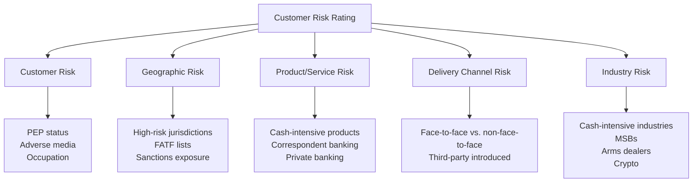

# Customer Risk Rating

## Overview

Customer risk rating is the process of assigning a risk classification (typically Low, Medium, High) to each customer based on their inherent money laundering/terrorist financing risk. This rating determines the level of due diligence and the frequency of ongoing monitoring/review.

## Risk Rating Factors

## Risk Scoring Methodology

Most institutions use a weighted scoring model:

| Factor | Weight | Example Scoring |
|---|---|---|
| Geographic risk | 25% | FATF blacklist = 10, Grey list = 7, Standard = 3, Low risk = 1 |
| Customer type | 20% | PEP = 10, Trust/complex entity = 8, Individual = 2 |
| Industry/business | 20% | MSB/Crypto = 9, Cash-intensive = 7, Standard = 3 |
| Product/service | 15% | Correspondent banking = 9, Trade finance = 7, Retail = 2 |
| Delivery channel | 10% | Non-face-to-face = 6, Third-party introduced = 7, Direct = 2 |
| Transaction behavior | 10% | Anomalous = 9, Consistent = 1 |

**Composite score → Risk tier:**
- 0–3.0: Low Risk
- 3.1–6.5: Medium Risk
- 6.6–10: High Risk

## Customer Risk Factors

- Occupation and source of income/wealth
- PEP or RCA (Relative/Close Associate of a PEP) status
- Adverse media findings
- Complexity of ownership structure (for entities)
- History with the institution (existing customer vs. new)
- Previous SAR filings or law enforcement inquiries

## Geographic Risk Factors

- FATF High-Risk and Increased Monitoring jurisdictions
- Basel AML Index ratings
- Transparency International Corruption Perceptions Index
- Country sanctions exposure
- Tax haven / secrecy jurisdiction status

→ [Country Risk](/docs/risk-assessment/country-risk)

## Product/Service Risk Factors

- Correspondent banking relationships
- Trade finance
- Private banking
- Cash-intensive products
- Cross-border wire transfers
- Cryptocurrency-related products

## Re-Rating Triggers

A customer's risk rating must be reassessed when:
- Material change in business activity or ownership
- New adverse media or sanctions hits identified
- Unusual transaction activity detected
- Customer relocates to/establishes ties with a high-risk jurisdiction
- Scheduled periodic review interval reached

## Periodic Review Frequency by Risk Rating

| Risk Rating | Typical Review Frequency |
|---|---|
| High Risk | Annually (or more frequently) |
| Medium Risk | Every 2-3 years |
| Low Risk | Every 3-5 years (or event-driven only) |

## Interview Questions

1. **What factors go into a customer risk rating?**
2. **How would you weight geographic risk vs. customer type risk?**
3. **What triggers a re-rating of an existing customer?**
4. **How does risk rating determine periodic review frequency?**

## Related Pages

- [CDD Overview](/docs/kyc/cdd/overview)
- [Risk Assessment Overview](/docs/risk-assessment/overview)
- [Country Risk](/docs/risk-assessment/country-risk)
- [EDD Triggers](/docs/edd/triggers)
