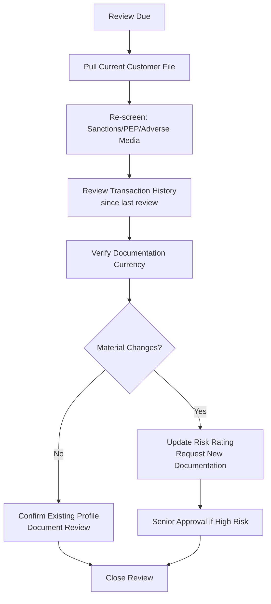

# Ongoing Monitoring

## What Is Ongoing Monitoring?

KYC does not end at onboarding. **Ongoing monitoring** is the continuous process of:
1. Monitoring transactions for consistency with the customer's known profile
2. Periodically reviewing and updating customer due diligence information
3. Re-screening customers against sanctions/PEP/adverse media lists

## Two Pillars of Ongoing Monitoring

### 1. Transaction Monitoring
Automated systems flag transactions inconsistent with the customer's expected activity, triggering alerts for investigation.

→ [Transaction Monitoring](/docs/transaction-monitoring/overview)

### 2. Periodic Review (KYC Refresh)
Scheduled reviews of the entire customer file — updating documentation, re-verifying information, and reassessing risk rating.

## Periodic Review Triggers

| Trigger Type | Examples |
|---|---|
| **Time-based** | Scheduled review per risk tier (annual for high-risk, etc.) |
| **Event-based** | Change of address, ownership change, new business activity |
| **Alert-based** | Transaction alert investigation reveals new risk factors |
| **Screening-based** | New sanctions/PEP/adverse media hit identified |
| **Regulatory-based** | New regulation requires re-verification (e.g., new beneficial ownership rules) |

## Periodic Review Process

## Re-Screening Requirements

Customers should be re-screened against sanctions, PEP, and adverse media lists:
- On a real-time or daily basis for sanctions (given list updates)
- At each periodic review
- When triggered by negative news monitoring alerts

## Red Flags Identified During Ongoing Monitoring

- Significant increase in transaction volume without business rationale
- New high-risk counterparties
- Customer relocates to or begins transacting with high-risk jurisdictions
- Adverse media coverage emerges
- Customer becomes a PEP (e.g., elected to office)
- Account dormancy followed by sudden high-value activity

## Interview Questions

1. **What are the two pillars of ongoing monitoring?**
2. **What triggers a periodic KYC review outside the scheduled cycle?**
3. **How often should high-risk customers be re-screened against sanctions lists?**

## Related Pages

- [CDD Overview](/docs/kyc/cdd/overview)
- [Transaction Monitoring](/docs/transaction-monitoring/overview)
- [Customer Risk Rating](/docs/kyc/cdd/customer-risk-rating)
