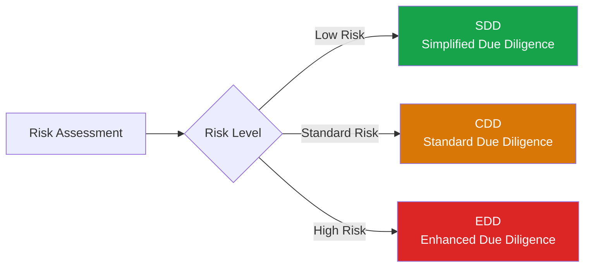

# Customer Due Diligence (CDD)

## What Is CDD?

**Customer Due Diligence (CDD)** goes beyond identity verification to understand the customer's business, the purpose and intended nature of the business relationship, and the risk they pose for money laundering or terrorist financing.

Where CIP answers "**who is this customer?**", CDD answers "**what is this customer's risk to my institution?**"

## The CDD Rule (FinCEN, USA Framework)

The FinCEN CDD Rule (2018) requires covered financial institutions to:
1. Identify and verify the identity of customers
2. Identify and verify the identity of beneficial owners of legal entity customers
3. Understand the nature and purpose of customer relationships
4. Conduct ongoing monitoring to identify and report suspicious transactions, and on a risk basis, maintain and update customer information

## Levels of Due Diligence

| Level | When Applied | Requirements |
|---|---|---|
| **SDD** (Simplified) | Low-risk customers (regulated entities, government bodies) | Reduced verification; basic identity confirmation |
| **CDD** (Standard) | Most customers | Full identity verification, business purpose, source of funds |
| **EDD** (Enhanced) | High-risk customers (PEPs, high-risk jurisdictions, complex structures) | All CDD elements plus deeper investigation of SoF/SoW, senior management approval |

→ [Simplified Due Diligence](/docs/kyc/cdd/simplified-due-diligence) | [EDD Overview](/docs/edd/overview)

## Core CDD Information to Collect

1. **Identity** — Already verified through CIP
2. **Business purpose** — Why is the customer opening this account/relationship?
3. **Expected activity** — What transaction volumes, types, and counterparties are expected?
4. **Source of funds** — Where is the money for this relationship coming from?
5. **Beneficial ownership** (for entities) — Who ultimately owns/controls the entity?
6. **Risk factors** — Geography, industry, product, delivery channel

## Customer Risk Rating

CDD culminates in a **customer risk rating**, typically Low/Medium/High, based on a combination of factors:

→ [Customer Risk Rating](/docs/kyc/cdd/customer-risk-rating)

## When Is EDD Triggered?

- Customer is a Politically Exposed Person (PEP)
- Customer is from or has significant ties to a high-risk jurisdiction
- Customer's business is in a high-risk industry (cash-intensive, MSBs, crypto, arms, etc.)
- Complex ownership structure with unclear UBO
- Adverse media findings
- Unusual transaction patterns identified post-onboarding
- Correspondent banking relationships
- Private banking / high-net-worth relationships above certain thresholds

→ [EDD Triggers](/docs/edd/triggers)

## Interview Questions

1. **What is the difference between CIP and CDD?**
2. **What are the three levels of due diligence (SDD/CDD/EDD)?**
3. **What information does CDD require beyond identity verification?**
4. **What factors trigger a customer to require EDD?**
5. **What is the FinCEN CDD Rule and what are its four pillars?**

## Related Pages

- [Simplified Due Diligence](/docs/kyc/cdd/simplified-due-diligence)
- [Customer Risk Rating](/docs/kyc/cdd/customer-risk-rating)
- [Ongoing Monitoring](/docs/kyc/cdd/ongoing-monitoring)
- [EDD Overview](/docs/edd/overview)
- [Risk Assessment](/docs/risk-assessment/overview)
