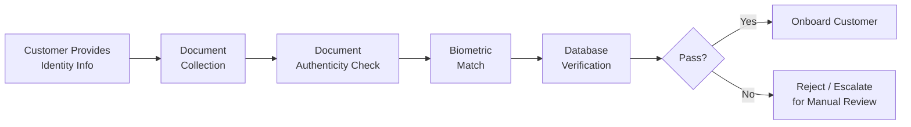

# Identity Verification

## Overview

Identity verification confirms that a customer is who they claim to be. It is the core function of CIP and the foundation upon which the entire KYC relationship is built.

## Verification Process

## Key Verification Elements

### Name Matching
- Full legal name must match across all documents
- Account for name variations (maiden names, aliases, transliterations)
- Be aware of common name romanization differences (especially for Chinese, Arabic, Indian names)

### Date of Birth Verification
- Cross-check across multiple documents
- Flag inconsistencies for further investigation

### Address Verification
- Utility bills, bank statements (typically less than 3 months old)
- Government correspondence
- Lease agreements
- Cross-reference with credit bureau data where available

### Unique Identifier Verification
- National ID numbers, SSN/Tax ID, passport numbers
- Verify format consistency for the issuing country
- Cross-check against government databases where accessible

## Verification Technology

| Technology | Function |
|---|---|
| OCR (Optical Character Recognition) | Extract data from ID documents |
| MRZ Reading | Machine-Readable Zone parsing on passports/IDs |
| NFC Chip Reading | Read embedded chip data on e-passports |
| Facial Recognition | Match selfie to ID photo |
| Liveness Detection | Confirm live presence vs. photo/deepfake |
| Database Verification | Cross-check against government/credit databases |

## Red Flags

- Inconsistent information across documents
- Document format inconsistent with issuing country standards
- Customer unable to answer basic questions about their own identity document
- Repeated verification failures
- Use of identity documents reported lost/stolen (where checkable)

## Interview Questions

1. **What are the key elements of identity verification?**
2. **What is an MRZ and how is it used in identity verification?**
3. **How does liveness detection prevent identity fraud?**

## Related Pages

- [CIP Overview](/docs/kyc/cip/overview)
- [Document Verification](/docs/kyc/cip/document-verification)
- [Biometric Verification](/docs/kyc/cip/biometric-verification)
