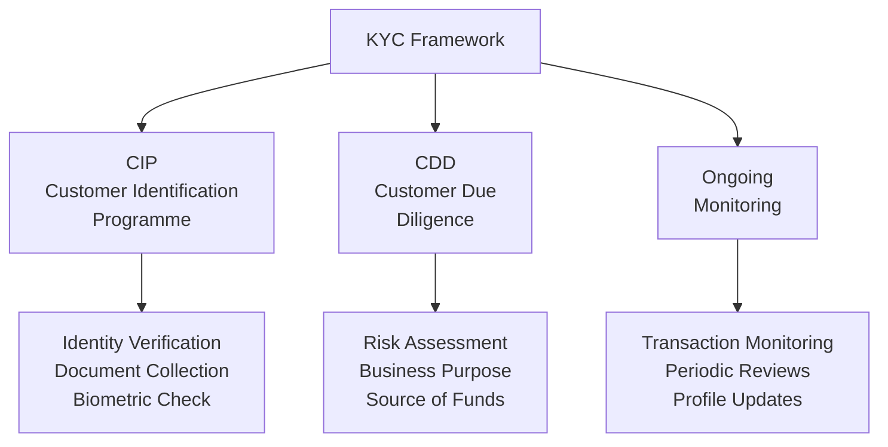

# Know Your Customer (KYC)

## What Is KYC?

**Know Your Customer (KYC)** is the process by which financial institutions and regulated entities verify the identity of their customers, understand the nature and purpose of their business relationships, and assess the associated money laundering and financial crime risk.

KYC is not a one-time event — it is an ongoing process that begins before a business relationship is established and continues throughout its duration.

:::info Regulatory Basis
KYC requirements are embedded in AML regulations globally:
- **BSA / USA PATRIOT Act** (USA) — Customer Identification Program (CIP), Customer Due Diligence Rule
- **MLR 2017** (UK) — Regulation 28: Customer due diligence measures
- **5AMLD / 6AMLD** (EU) — Customer due diligence requirements
- **FATF Recommendations 10–12** — CDD measures
:::

## The Three Components of KYC

### 1. Customer Identification Programme (CIP)
Verifying that the customer is who they claim to be — collecting and verifying identity information through documents, databases, or biometric checks.

→ [CIP Overview](/docs/kyc/cip/overview)

### 2. Customer Due Diligence (CDD)
Understanding the customer beyond their identity — their business, source of funds, nature of the expected relationship, and the AML risk they represent.

→ [CDD Overview](/docs/kyc/cdd/overview)

### 3. Ongoing Monitoring
Continuously monitoring transactions and periodically reviewing customer information to ensure it remains accurate and that activity is consistent with the customer's profile.

→ [Ongoing Monitoring](/docs/kyc/cdd/ongoing-monitoring)

## Risk-Based Approach

KYC must be applied in a **risk-proportionate** manner. This means:

- **Low-risk customers** → Simplified Due Diligence (SDD)
- **Standard-risk customers** → Standard CDD
- **High-risk customers** → Enhanced Due Diligence (EDD)

The risk-based approach ensures that KYC resources are directed where they are most needed without placing unnecessary burden on low-risk customers.

## When Must KYC Be Conducted?

KYC (or updates to existing KYC) is required:
1. **At onboarding** — Before establishing a business relationship
2. **At transaction** — For occasional transactions above thresholds
3. **When suspicion arises** — When there are grounds to suspect ML/TF regardless of other factors
4. **At periodic review** — Based on risk rating (annually for high-risk, less frequently for lower-risk)
5. **When material changes occur** — Change in ownership, business model, country of operation, etc.

## Key KYC Documents

### For Individuals
| Document | Purpose |
|---|---|
| Government-issued photo ID (passport, driver's licence, national ID) | Identity verification |
| Proof of address (utility bill, bank statement) | Address verification |
| Source of funds documentation | AML risk mitigation |
| Source of wealth documentation (for high-risk/PEPs) | EDD requirement |

### For Businesses
| Document | Purpose |
|---|---|
| Certificate of Incorporation | Entity verification |
| Memorandum & Articles of Association | Corporate structure |
| Register of Directors | Control verification |
| Register of Shareholders | Ownership verification |
| UBO Declaration | Beneficial ownership |
| Proof of business address | Operational verification |
| Source of funds documentation | AML risk mitigation |

## KYC vs. KYB

| | KYC | KYB |
|---|---|---|
| **Full Name** | Know Your Customer | Know Your Business |
| **Subject** | Individual customers | Business entities |
| **Key Elements** | ID, address, SoF | Corporate docs, UBO, business purpose |
| **Complexity** | Lower | Higher (layered structures) |
| **Regulatory Framework** | CIP/CDD rules | CDD Rule for legal entities |

## Interview Questions

1. **What are the three components of KYC?**
2. **What is the difference between CDD, SDD, and EDD?**
3. **When does KYC need to be refreshed/updated?**
4. **What documents do you collect for individual vs. business KYC?**
5. **What is the risk-based approach to KYC?**

## KYC Checklist

- [ ] Customer identity verified against government-issued ID
- [ ] Address verified (document less than 3 months old)
- [ ] PEP/Sanctions screening conducted
- [ ] Adverse media check completed
- [ ] Nature and purpose of business relationship documented
- [ ] Expected transaction profile established
- [ ] Risk rating assigned (Low/Medium/High)
- [ ] Level of due diligence proportionate to risk (SDD/CDD/EDD)
- [ ] Beneficial ownership identified (for business customers)
- [ ] Ongoing monitoring schedule set

## Related Pages

- [CIP Overview](/docs/kyc/cip/overview)
- [CDD Overview](/docs/kyc/cdd/overview)
- [EDD Overview](/docs/edd/overview)
- [KYB Overview](/docs/kyb/overview)
- [Sanctions Screening](/docs/screening/sanctions/overview)
- [PEP Screening](/docs/screening/pep/overview)
