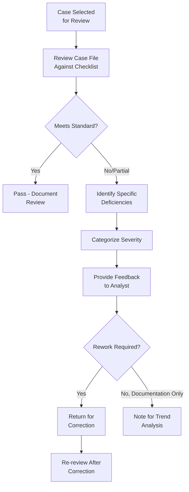

# QC Process and Methodology

## Standard QC Review Workflow

## QC Checklist Categories

### Documentation Completeness
- [ ] All required fields populated
- [ ] Supporting evidence attached/referenced
- [ ] Required approvals obtained

### Investigation Quality
- [ ] All relevant red flags addressed
- [ ] Adequate research conducted (not just superficial check)
- [ ] Conclusion logically follows from evidence presented

### Decision Appropriateness
- [ ] Decision consistent with policy and similar precedent cases
- [ ] Risk rating appropriately assigned
- [ ] SAR consideration appropriately documented (whether filed or not)

### Procedural Compliance
- [ ] SLA met
- [ ] Required escalations occurred where applicable
- [ ] Confidentiality/tipping-off rules respected

## Defect Severity Classification

| Severity | Definition | Example |
|---|---|---|
| **Critical** | Regulatory/legal exposure; case decision likely wrong | SAR not filed despite clear suspicious activity |
| **Major** | Significant gap affecting decision reliability | Missing source of funds verification on high-risk case |
| **Minor** | Documentation/process gap not affecting decision validity | Missing date field, minor formatting issue |
| **Observation** | Best practice suggestion, no policy violation | Narrative could be more detailed for clarity |

## Feedback Delivery Best Practices

- Provide specific, actionable feedback (not just "needs improvement")
- Distinguish between individual analyst errors and systemic/training issues
- Recognize good practice, not just deficiencies
- Track recurring issues across reviews to identify training needs

## QC Metrics and Reporting

| Metric | Purpose |
|---|---|
| Pass rate | Overall quality trend |
| Defect rate by category | Identifies specific weakness areas |
| Defect rate by analyst | Identifies individual training needs (used carefully, constructively) |
| Re-review pass rate | Measures effectiveness of corrective feedback |
| Time to remediate | Process efficiency |

## Interview Questions

1. **Walk through your QC review process for an EDD case file.**
2. **How would you classify defect severity, and why does this classification matter?**
3. **How would you deliver constructive feedback to an analyst who repeatedly makes similar errors?**
4. **What metrics would you report to management about QC program performance?**

## Related Pages

- [QA Overview](/docs/qa/overview)
- [Audit Checklist](/docs/qa/audit-checklist)
- [EDD Narrative Writing](/docs/edd/narrative-writing)
