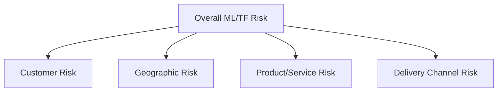

# Risk Assessment Overview

## The Risk-Based Approach (RBA)

FATF Recommendation 1 establishes the **Risk-Based Approach** as the cornerstone of modern AML compliance. Institutions must identify, assess, and understand their money laundering/terrorist financing risks, and apply AML resources proportionately — more scrutiny where risk is higher, less where risk is lower.

## The Four Pillars of Risk Assessment

### 1. Customer Risk
Who is the customer, and what inherent risk do they present?

→ [Customer Risk](/docs/risk-assessment/customer-risk)

### 2. Geographic / Country Risk
Where is the customer located, and where do they transact?

→ [Country Risk](/docs/risk-assessment/country-risk)

### 3. Industry Risk
What industry/business sector does the customer operate in?

→ [Industry Risk](/docs/risk-assessment/industry-risk)

### 4. Product/Service Risk
What products or services is the customer using, and what inherent ML/TF risk do they carry?

### 5. Transaction Risk
How are transactions conducted, and what risk does the pattern present?

→ [Transaction Risk](/docs/risk-assessment/transaction-risk)

### 6. Delivery Channel Risk
How is the relationship conducted — face-to-face, digital, through intermediaries?

## Enterprise-Wide Risk Assessment (EWRA)

Beyond individual customer risk rating, institutions must conduct an **Enterprise-Wide Risk Assessment** — a holistic assessment of the institution's overall exposure to ML/TF risk across its entire business, considering:
- Customer base composition
- Products and services offered
- Geographic footprint
- Delivery channels used
- Regulatory environment

The EWRA informs resource allocation, policy design, and the overall AML program structure.

## Risk Assessment Methodology

→ [Risk Rating Methodology](/docs/risk-assessment/risk-rating-methodology)

## Interview Questions

1. **What is the Risk-Based Approach and why is it foundational to AML?**
2. **What are the key risk categories assessed for any customer?**
3. **What is an Enterprise-Wide Risk Assessment and how does it differ from customer-level risk rating?**

## Related Pages

- [Customer Risk](/docs/risk-assessment/customer-risk)
- [Country Risk](/docs/risk-assessment/country-risk)
- [Industry Risk](/docs/risk-assessment/industry-risk)
- [Transaction Risk](/docs/risk-assessment/transaction-risk)
- [Risk Rating Methodology](/docs/risk-assessment/risk-rating-methodology)
- [Customer Risk Rating (KYC)](/docs/kyc/cdd/customer-risk-rating)
