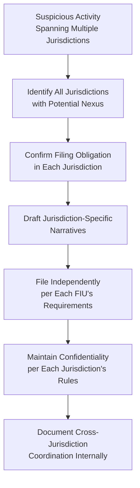

# Multi-Jurisdiction SAR/STR Filing

## The Challenge of Multi-Jurisdiction Filing

Global institutions and payment gateways often must consider SAR/STR obligations across **multiple jurisdictions simultaneously** when suspicious activity spans borders. This requires understanding:
- Which jurisdiction(s) have a filing obligation for a given transaction/relationship
- The specific format and content requirements of each relevant FIU
- Coordination to avoid duplicative or contradictory filings while meeting each jurisdiction's independent obligations

## When Multiple Jurisdictions May Require Filing

| Scenario | Jurisdictions Potentially Requiring Filing |
|---|---|
| Customer resident in Country A, transacting with counterparty in Country B, through institution licensed in Country C | Potentially all three, depending on local law and nexus |
| Global payment gateway processing transaction with sender in UK, receiver in India | Both UK (NCA) and India (FIU-IND) may have independent obligations |
| Correspondent banking relationship spanning multiple countries | Each correspondent bank in the chain may have independent SAR obligations under their own jurisdiction's law |

## Key Principles for Multi-Jurisdiction Analysis

1. **Each jurisdiction's obligation is independent** — Filing in one jurisdiction does not satisfy obligations in another
2. **Local nexus determines obligation** — Generally, if the institution (or relevant branch/subsidiary) operates under that jurisdiction's AML law and the activity has sufficient connection, a filing obligation likely exists
3. **Format and content vary** — Each FIU has its own reporting format (e.g., goAML is used by many countries including UAE, India in part, though specific schemas vary)
4. **Confidentiality rules vary** — Some jurisdictions permit limited information sharing between group entities about SAR filings (with strict controls); others prohibit it entirely

## goAML Platform

Many FIUs globally (UAE, and various others) use the UN Office on Drugs and Crime's **goAML** software platform for electronic SAR/STR submission, providing some degree of format consistency across goAML-adopting jurisdictions, though content requirements still vary.

## Practical Workflow for Multi-Jurisdiction Cases

## Common Pitfalls

- Assuming one filing satisfies all relevant jurisdictions' requirements
- Using a single generic narrative without adapting to each jurisdiction's specific format/content expectations
- Failing to identify all jurisdictions with a potential filing nexus
- Inappropriate information sharing between group entities regarding SAR filings without confirming this is legally permitted in the relevant jurisdictions

## Interview Questions

1. **If a payment gateway processes a suspicious transaction between a UK sender and an India-based receiver, which jurisdictions might require SAR/STR filing?**
2. **Why can't filing in one jurisdiction satisfy obligations in another?**
3. **What is goAML and how does it relate to multi-jurisdiction filing?**

## Related Pages

- [SAR Overview](/docs/sar/overview)
- [Filing Requirements](/docs/sar/filing-requirements)
- [Narrative Writing](/docs/sar/narrative-writing)
