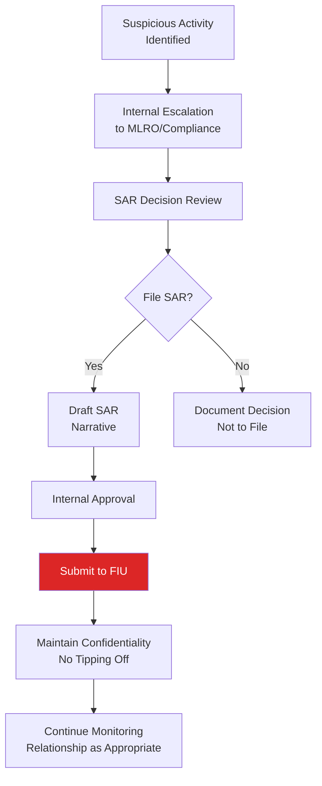

# Suspicious Activity Reports (SAR) / Suspicious Transaction Reports (STR)

## What Is a SAR/STR?

A **Suspicious Activity Report (SAR)** — called a **Suspicious Transaction Report (STR)** in many non-US jurisdictions — is a formal report filed by a financial institution with the relevant Financial Intelligence Unit (FIU) when there are grounds to suspect that a transaction or activity is related to money laundering, terrorist financing, or other financial crime.

:::info Terminology Note
"SAR" is the standard term in the US, UK, and several other jurisdictions. "STR" is used in many other countries (e.g., India, Singapore, UAE). The underlying concept — a report of suspicious financial activity to the national FIU — is fundamentally the same.
:::

## Legal Basis for SAR/STR Filing

| Jurisdiction | Legislation | Filing Body |
|---|---|---|
| United States | Bank Secrecy Act | FinCEN |
| United Kingdom | Proceeds of Crime Act 2002 (POCA) | National Crime Agency (NCA), via UKFIU |
| European Union | AML Directives (transposed nationally) | National FIUs (varies by member state) |
| India | Prevention of Money Laundering Act 2002 | Financial Intelligence Unit-India (FIU-IND) |
| Singapore | CDSA / MAS Notices | Suspicious Transaction Reporting Office (STRO) |
| UAE | Federal Decree-Law No. 20 of 2018 | UAE Financial Intelligence Unit (goAML platform) |
| Australia | AML/CTF Act 2006 | AUSTRAC |

## When Must a SAR Be Filed?

The threshold for filing is **suspicion**, not certainty. A SAR should be filed when an institution has reasonable grounds to suspect that funds or activity are connected to criminal conduct — there is **no minimum transaction amount** for SAR filing (unlike CTRs).

Common triggers for SAR consideration:
- Transaction monitoring alert escalation reveals unexplained suspicious activity
- EDD investigation cannot resolve red flags satisfactorily
- Sanctions/PEP hit confirmed as true match with suspicious context
- Customer behavior consistent with known typologies
- Law enforcement inquiry/subpoena received

## SAR Filing Process

## Confidentiality and "Tipping Off"

Filing a SAR/STR is strictly confidential. Most jurisdictions criminalize **"tipping off"** — informing the customer or any third party that a SAR has been filed or is being considered. This protects the integrity of law enforcement investigations.

## SAR vs. Continuing the Relationship

Filing a SAR does **not** automatically require terminating the customer relationship. The decision to continue, restrict, or exit the relationship is separate from the filing decision, though in practice, confirmed serious suspicion often leads to relationship termination following appropriate risk assessment.

## Defensive Filing — A Word of Caution

"Defensive filing" — filing SARs reflexively to avoid regulatory criticism rather than based on genuine suspicion — is discouraged by regulators (including FinCEN) as it dilutes the quality and utility of SAR data for law enforcement. Each SAR decision should be based on a genuine, documented suspicion assessment.

## Interview Questions

1. **What is a SAR/STR and what is the legal basis for filing one?**
2. **What is the suspicion threshold for filing, and how does it differ from CTR thresholds?**
3. **What is "tipping off" and why is it prohibited?**
4. **Does filing a SAR require terminating the customer relationship?**
5. **What is "defensive filing" and why is it discouraged?**

## Related Pages

- [Filing Requirements](/docs/sar/filing-requirements)
- [Narrative Writing](/docs/sar/narrative-writing)
- [Multi-Jurisdiction Filing](/docs/sar/multi-jurisdiction)
- [Case Documentation](/docs/sar/case-documentation)
- [SAR Builder Lab](/docs/labs/sar-narrative-builder)
