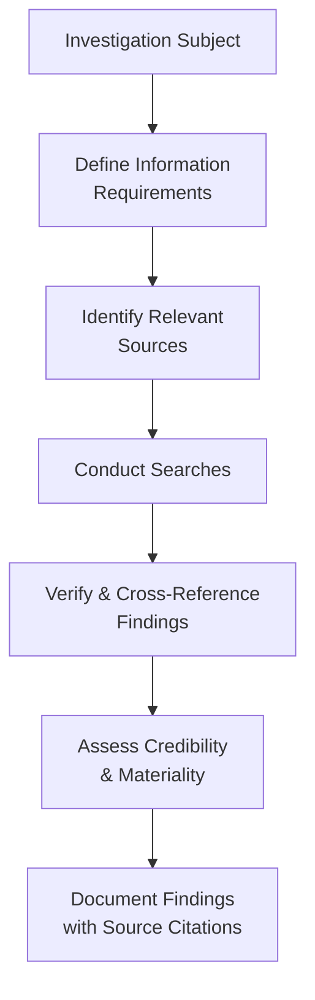

# Open-Source Intelligence (OSINT) for AML/KYC

## What Is OSINT?

**Open-Source Intelligence (OSINT)** refers to the collection and analysis of publicly available information to support investigations. In the AML/KYC context, OSINT supplements formal screening databases (sanctions, PEP, commercial adverse media tools) with broader, more flexible research techniques.

## Why OSINT Matters for AML Analysts

Commercial screening tools (CLEAR, World-Check, etc.) are essential but have limitations:
- They may not cover every jurisdiction comprehensively
- They rely on indexed/curated sources, missing some local or niche information
- They don't verify the operational reality of businesses (websites, online presence)

OSINT fills these gaps through direct research using public tools and techniques.

## Core OSINT Techniques

→ [Google Dorks](/docs/screening/osint/google-dorks) | [Business Registries](/docs/screening/osint/business-registries) | [WHOIS](/docs/screening/osint/whois) | [Court Records](/docs/screening/osint/court-records)

### Search Engine Techniques
Advanced search operators ("Google dorks") to narrow results and find specific information types.

### Business Registry Research
Direct lookup in official corporate registries to verify entity status, directors, and filings.

### Domain/Website Investigation
WHOIS lookups, website archive history (Wayback Machine), and technical analysis of website infrastructure.

### Social Media Research
Public social media profiles can provide insight into lifestyle, business activities, and associations (used cautiously and proportionately).

### Court and Litigation Records
Public court filing databases reveal litigation history that may not appear in news media.

## OSINT Ethical and Legal Considerations

- Only use publicly available information through legitimate means
- Never attempt to access non-public/restricted information (hacking, social engineering)
- Be mindful of data protection regulations (GDPR, etc.) when collecting and storing personal information
- Document sources for audit trail purposes
- Be aware of jurisdiction-specific restrictions on certain types of research

## OSINT Investigation Framework

## Interview Questions

1. **What is OSINT and how does it complement commercial screening tools?**
2. **What ethical considerations apply to OSINT research?**
3. **Give examples of OSINT techniques you would use to verify a business's legitimacy.**

## Related Pages

- [Google Dorks](/docs/screening/osint/google-dorks)
- [Business Registries](/docs/screening/osint/business-registries)
- [WHOIS](/docs/screening/osint/whois)
- [Court Records](/docs/screening/osint/court-records)
- [OSINT Investigation Lab](/docs/labs/merchant-investigation)
