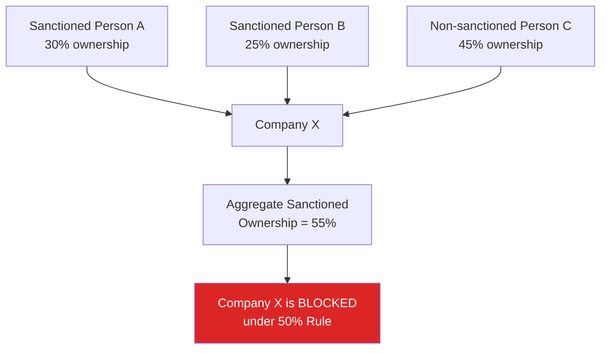

# The 50% Rule

## What Is the 50% Rule?

The **50% Rule** is a critical sanctions compliance principle (most explicitly articulated by OFAC, but applied in concept by other regimes) stating that any entity owned **50% or more, in the aggregate**, by one or more blocked/sanctioned persons is itself considered blocked — **even if the entity is not separately named on any sanctions list.**

:::danger Why This Matters
This means an entity can be sanctioned by operation of law without ever appearing on a published list. Compliance teams must proactively calculate aggregate ownership by sanctioned parties — screening only against named entities is insufficient.
:::

## How the Aggregation Works

The rule aggregates ownership across **multiple** sanctioned parties, not just one:

**Example:** Sanctioned Individual A owns 30% of Company X. Sanctioned Individual B (unrelated to A, but also separately sanctioned) owns 25% of Company X. Combined sanctioned ownership = 55% → Company X is blocked under the 50% Rule, even though neither individual alone crosses 50%.

## Multi-Layer Application

The 50% Rule applies through multiple ownership layers — if a blocked entity owns 50%+ of Company A, and Company A owns 50%+ of Company B, then Company B is also blocked (the "block" cascades down the ownership chain).

**Important:** Indirect ownership calculations multiply through each layer, similar to UBO calculations — see [Beneficial Owner Identification](/docs/kyb/ubo/beneficial-owner-identification) for the calculation methodology.

## What This Means in Practice for Analysts

When conducting KYB/EDD on an entity, analysts must:
1. Identify **all** owners at each layer, not just stop once a clean match is found
2. Determine whether **any combination** of owners are themselves sanctioned
3. Calculate the **aggregate** sanctioned ownership percentage
4. If aggregate ownership ≥50%, treat the entity as blocked regardless of whether it appears on any published list

## Control-Based Extension

Some guidance also extends beyond pure ownership to **control** — if a sanctioned person controls an entity (e.g., through voting rights or board control) even without 50% ownership, additional scrutiny and risk mitigation may be warranted, though the strict 50% Rule itself is ownership-based.

## Practical Challenges

- **Opaque ownership** — If beneficial ownership cannot be fully verified, the 50% Rule cannot be confidently applied or excluded
- **Changing ownership** — Ownership percentages can shift; periodic re-verification is needed for higher-risk entities
- **Multiple jurisdictions' rules differ** — Not all sanctioning bodies apply an identical 50% standard; some use lower thresholds or control-based tests

## Case Study: Applying the 50% Rule

**Structure:**
- Holding Co Z is owned: 35% by Sanctioned Person 1, 20% by Sanctioned Person 2, 45% by non-sanctioned Person 3
- Holding Co Z owns 100% of Subsidiary Y

**Analysis:**
- Aggregate sanctioned ownership of Holding Co Z = 35% + 20% = 55% → Holding Co Z is blocked
- Since Holding Co Z is blocked and owns 100% of Subsidiary Y, Subsidiary Y is also blocked (cascading effect)

**Conclusion:** Any transaction with Subsidiary Y must be treated as a transaction with a blocked entity, despite neither Holding Co Z nor Subsidiary Y appearing by name on the SDN List.

## Interview Questions

1. **Explain the 50% Rule and why it matters even for entities not on a sanctions list.**
2. **If two unrelated sanctioned individuals each own 30% of a company, is that company blocked? Why?**
3. **How does the 50% Rule cascade through multi-layer ownership structures?**
4. **What practical challenges arise when applying the 50% Rule to opaque ownership structures?**

## Related Pages

- [Sanctions Overview](/docs/screening/sanctions/overview)
- [OFAC](/docs/screening/sanctions/ofac)
- [UBO Overview](/docs/kyb/ubo/overview)
- [Beneficial Owner Identification](/docs/kyb/ubo/beneficial-owner-identification)
