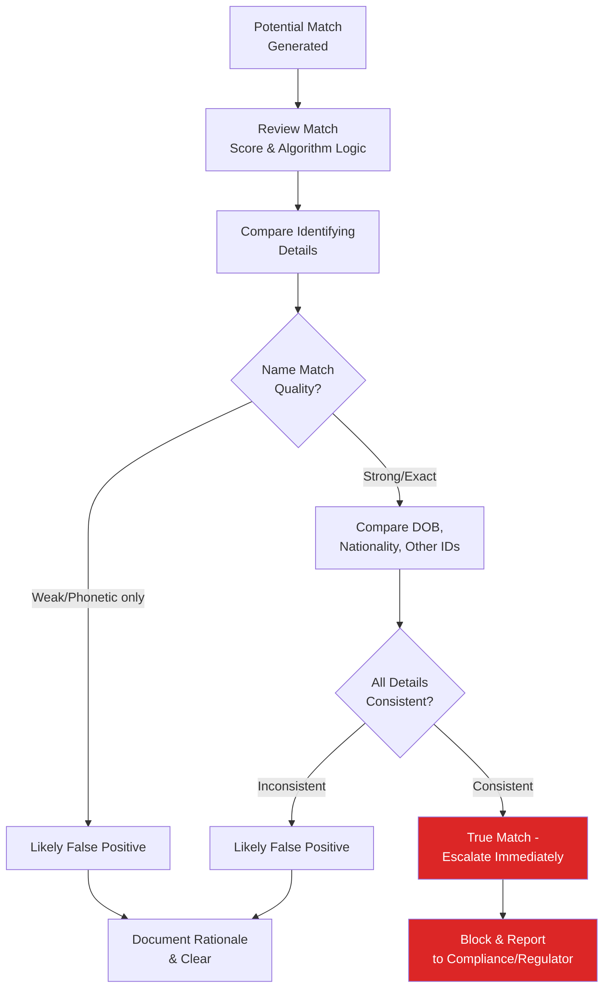

# Sanctions Hit Resolution

## Overview

When a screening system flags a potential match against a sanctions list, the analyst must determine whether it is a **true match** or a **false positive**. This process — hit resolution — is one of the most common day-to-day tasks for sanctions screening analysts.

## Hit Resolution Workflow

## Key Identifying Details to Compare

| Detail | Why It Matters |
|---|---|
| Full name (and variations/AKAs) | Primary matching criterion |
| Date of birth | Strong differentiator for common names |
| Nationality/place of birth | Additional differentiator |
| Passport/ID number | Highest confidence differentiator if available |
| Address | Supporting evidence |
| Gender | Can quickly rule out mismatches |

## Common False Positive Scenarios

- Common name with no other matching identifiers (e.g., "Mohammed Ahmed" with different DOB and nationality than the sanctioned individual)
- Partial/phonetic match algorithm triggered by similar-sounding but distinct names
- Name matches but all other available identifiers differ substantially

## Common True Match Indicators

- Exact or near-exact name match
- Matching date of birth
- Matching nationality and/or passport number
- Matching known aliases

## Documentation Standards for Hit Resolution

Every hit resolution decision — whether cleared or escalated — should be documented with:
1. The screening result/match score
2. The comparison analysis performed
3. The identifying details compared
4. The conclusion reached and rationale
5. Analyst name and date

:::tip Why Documentation of False Positives Matters
Regulators and auditors review hit resolution decisions to confirm a reasonable process was followed. A poorly documented "clear" decision on what later proves to be a true match exposes the institution to significant regulatory risk.
:::

## Escalation Path for True Matches

1. Immediate transaction block/account freeze
2. Notification to compliance/MLRO (Money Laundering Reporting Officer)
3. Regulatory reporting (OFAC, OFSI, etc., per jurisdiction's specific reporting timeline requirements)
4. Internal SAR consideration
5. Legal review for any licensing requirements (e.g., to release blocked funds in compliant circumstances)

## Interview Questions

1. **Walk through how you would resolve a name-only sanctions match with no other identifying details.**
2. **What identifying details give you the highest confidence in confirming a true match?**
3. **Why is documentation of false positive clearances important even when no further action is taken?**
4. **What is your escalation process upon confirming a true sanctions match?**

## Related Pages

- [Sanctions Overview](/docs/screening/sanctions/overview)
- [OFAC](/docs/screening/sanctions/ofac)
- [Sanctions Screening Lab](/docs/labs/sanctions-screening)
