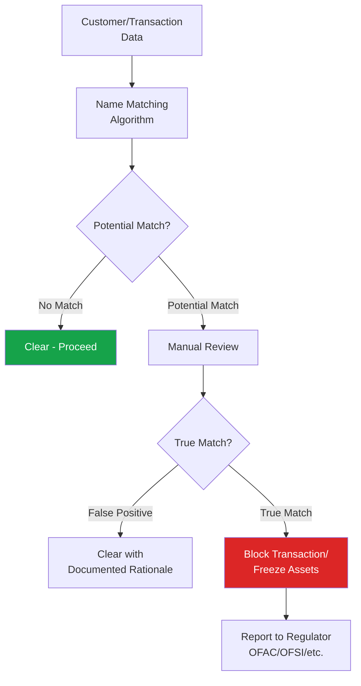

# Sanctions Screening

## What Is Sanctions Screening?

**Sanctions screening** is the process of checking customers, transactions, and counterparties against government-issued lists of individuals, entities, and countries subject to economic and trade restrictions. Sanctions compliance is strict liability in most jurisdictions — meaning intent is not required for a violation to occur.

:::danger Strict Liability
Unlike many AML obligations, sanctions violations are typically **strict liability** offenses. An institution can be penalized for processing a transaction involving a sanctioned party even without knowledge or intent, making robust screening critical.
:::

## Major Sanctions Regimes

| Regime | Administering Body | Scope |
|---|---|---|
| **OFAC** | US Treasury (Office of Foreign Assets Control) | US persons, USD transactions globally (extraterritorial reach) |
| **UN Sanctions** | UN Security Council | All UN member states (binding) |
| **EU Sanctions** | European Council | EU member states |
| **UK Sanctions (OFSI)** | Office of Financial Sanctions Implementation | UK persons/entities |
| **Other national regimes** | Various (Australia DFAT, Canada, Switzerland SECO, Singapore MAS) | Respective jurisdictions |

→ [OFAC Detail](/docs/screening/sanctions/ofac) | [UN Sanctions](/docs/screening/sanctions/un-sanctions) | [EU Sanctions](/docs/screening/sanctions/eu-sanctions) | [UK Sanctions](/docs/screening/sanctions/uk-sanctions)

## Types of Sanctions

### Comprehensive Sanctions
Broad restrictions on virtually all transactions with a country (e.g., North Korea, Cuba historically, Iran).

### Targeted/Smart Sanctions
Restrictions targeting specific individuals, entities, or sectors rather than entire countries (e.g., Specially Designated Nationals under OFAC).

### Sectoral Sanctions
Restrictions on specific sectors of an economy (e.g., Russian energy/defense sectors under sectoral sanctions).

### Secondary Sanctions
Sanctions that penalize non-US persons for transacting with sanctioned parties, extending reach beyond direct jurisdiction.

## Sanctions Screening Process

→ [Hit Resolution Process](/docs/screening/sanctions/hit-resolution)

## Fuzzy Matching and Name Variations

Sanctions screening systems use fuzzy matching algorithms because names can appear in many variations:
- Transliteration differences (Mohammed/Muhammad/Mohamed)
- Order variations (given name/surname conventions vary by culture)
- Aliases and "also known as" (AKA) names
- Date of birth and nationality as additional matching criteria

## The 50% Rule

Sanctions ownership/control rules extend beyond directly designated individuals — see [50% Rule](/docs/screening/sanctions/50-percent-rule) for detailed coverage of how entities owned by sanctioned individuals become sanctioned themselves.

## Key Screening Lists

| List | Issuer |
|---|---|
| SDN List (Specially Designated Nationals) | OFAC |
| Consolidated List | UN Security Council |
| Consolidated List of Financial Sanctions Targets | OFSI (UK) |
| Consolidated List | EU |
| World-Check / CLEAR / Dow Jones Risk & Compliance | Commercial screening databases (aggregate multiple lists) |

## Interview Questions

1. **Why is sanctions compliance considered strict liability?**
2. **What is the difference between comprehensive, targeted, sectoral, and secondary sanctions?**
3. **How do fuzzy matching algorithms handle name variations in screening?**
4. **What would you do if you identified a potential sanctions match?**

## Related Pages

- [OFAC](/docs/screening/sanctions/ofac)
- [UN Sanctions](/docs/screening/sanctions/un-sanctions)
- [EU Sanctions](/docs/screening/sanctions/eu-sanctions)
- [UK Sanctions](/docs/screening/sanctions/uk-sanctions)
- [50% Rule](/docs/screening/sanctions/50-percent-rule)
- [Hit Resolution](/docs/screening/sanctions/hit-resolution)
- [Sanctions Screening Lab](/docs/labs/sanctions-screening)
