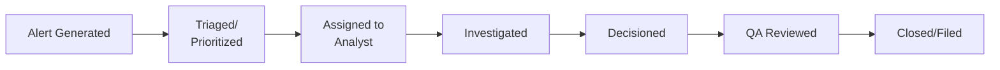

# Alert Management

## Alert Lifecycle

## Alert Prioritization

Most institutions triage alerts by risk severity to ensure higher-risk alerts are investigated first within SLA constraints:

| Priority | Criteria | Typical SLA |
|---|---|---|
| Critical | Sanctions-adjacent, high-value, known high-risk customer | 24-48 hours |
| High | High-risk customer segment, significant deviation | 3-5 business days |
| Medium | Standard risk customer, moderate deviation | 10 business days |
| Low | Minor threshold breach, low-risk customer | 15-20 business days |

## Case Assignment Approaches

- **Skill-based routing** — Complex cases (e.g., trade finance, crypto) assigned to specialized analysts
- **Round-robin** — Even distribution across team
- **Risk-tiered teams** — Junior analysts handle standard cases; senior analysts handle complex/high-risk cases

## Quality Control in Alert Handling

A robust QA process should sample closed alerts to verify:
- Investigation depth was adequate
- Documentation supports the conclusion reached
- Decision (close vs. escalate) was appropriate given the evidence
- SLA compliance

→ [QA Process](/docs/qa/qc-process)

## Interview Questions

1. **How would you prioritize a backlog of pending alerts?**
2. **What's the difference between skill-based and round-robin case assignment?**
3. **What does a QA reviewer look for when sampling closed alerts?**

## Related Pages

- [Transaction Monitoring Overview](/docs/transaction-monitoring/overview)
- [Investigation Process](/docs/transaction-monitoring/investigation-process)
- [QA Overview](/docs/qa/overview)
