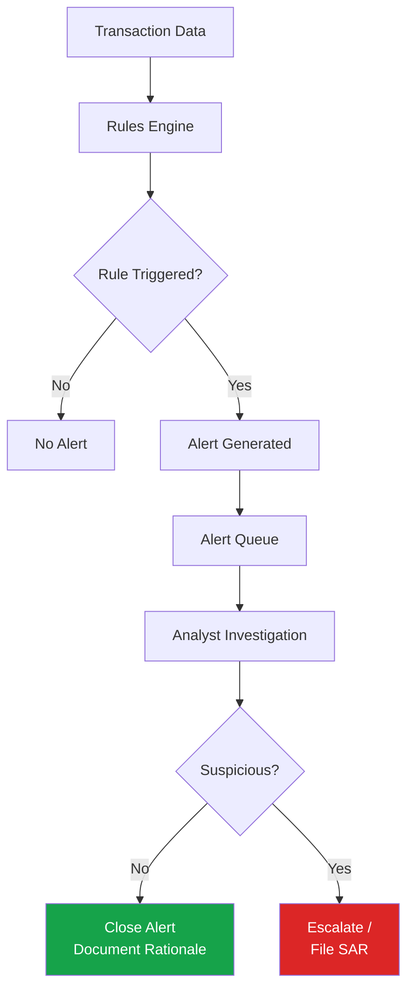

# Transaction Monitoring

## What Is Transaction Monitoring?

**Transaction Monitoring (TM)** is the ongoing process of reviewing customer transactions — in real-time or retrospectively — to identify patterns consistent with money laundering, terrorist financing, fraud, or other financial crime, and to ensure activity remains consistent with the customer's expected profile.

## Why Transaction Monitoring Matters

Even with thorough onboarding KYC/CDD, customer behavior can change, accounts can be compromised, or initial risk assessments may not fully capture actual usage patterns. TM is the primary control for detecting suspicious activity **after** the relationship has been established.

## Transaction Monitoring System Architecture

## Types of Monitoring Rules/Scenarios

→ [Rules and Scenarios Detail](/docs/transaction-monitoring/rules-and-scenarios)

| Scenario Type | Example |
|---|---|
| Threshold-based | Transaction exceeds $X in a single transaction |
| Velocity-based | Multiple transactions exceeding $X within Y hours |
| Pattern-based | Structuring patterns, round-dollar amounts |
| Geographic | Transactions involving high-risk jurisdictions |
| Behavioral | Significant deviation from established customer profile |
| Network-based | Connections to known suspicious accounts/entities |

## Alert Investigation Workflow

→ [Investigation Process Detail](/docs/transaction-monitoring/investigation-process)

1. Alert generated by rules engine
2. Analyst reviews alert details and underlying transactions
3. Analyst reviews customer profile and KYC information
4. Analyst conducts additional research (OSINT, prior alerts, related accounts)
5. Analyst determines: false positive (close) or suspicious (escalate)
6. If escalated: senior analyst/QA review, SAR consideration

## False Positive Management

Transaction monitoring systems generate significant false positive rates (often >90% in unoptimized systems). Effective false positive management involves:
- **Rule tuning** — Adjusting thresholds based on historical alert quality data
- **Segmentation** — Applying different rule parameters to different customer segments/risk profiles
- **Above-the-line/below-the-line testing** — Periodically testing whether closed (non-alerted) transactions should have triggered alerts, to validate rule coverage

## Key Performance Metrics

| Metric | Description |
|---|---|
| Alert volume | Total alerts generated per period |
| Productivity rate | % of alerts resulting in SAR/escalation |
| False positive rate | % of alerts closed as non-suspicious |
| Average handling time | Time taken to investigate and close an alert |
| Backlog | Number of alerts pending investigation beyond SLA |

## Interview Questions

1. **What is transaction monitoring and why is it necessary even after thorough onboarding KYC?**
2. **What types of monitoring scenarios/rules are commonly used?**
3. **How do you manage high false positive rates in a TM system?**
4. **What metrics would you track to assess TM program effectiveness?**

## Related Pages

- [Alert Management](/docs/transaction-monitoring/alert-management)
- [Rules and Scenarios](/docs/transaction-monitoring/rules-and-scenarios)
- [Investigation Process](/docs/transaction-monitoring/investigation-process)
- [Red Flags](/docs/transaction-monitoring/red-flags)
- [SAR Overview](/docs/sar/overview)
